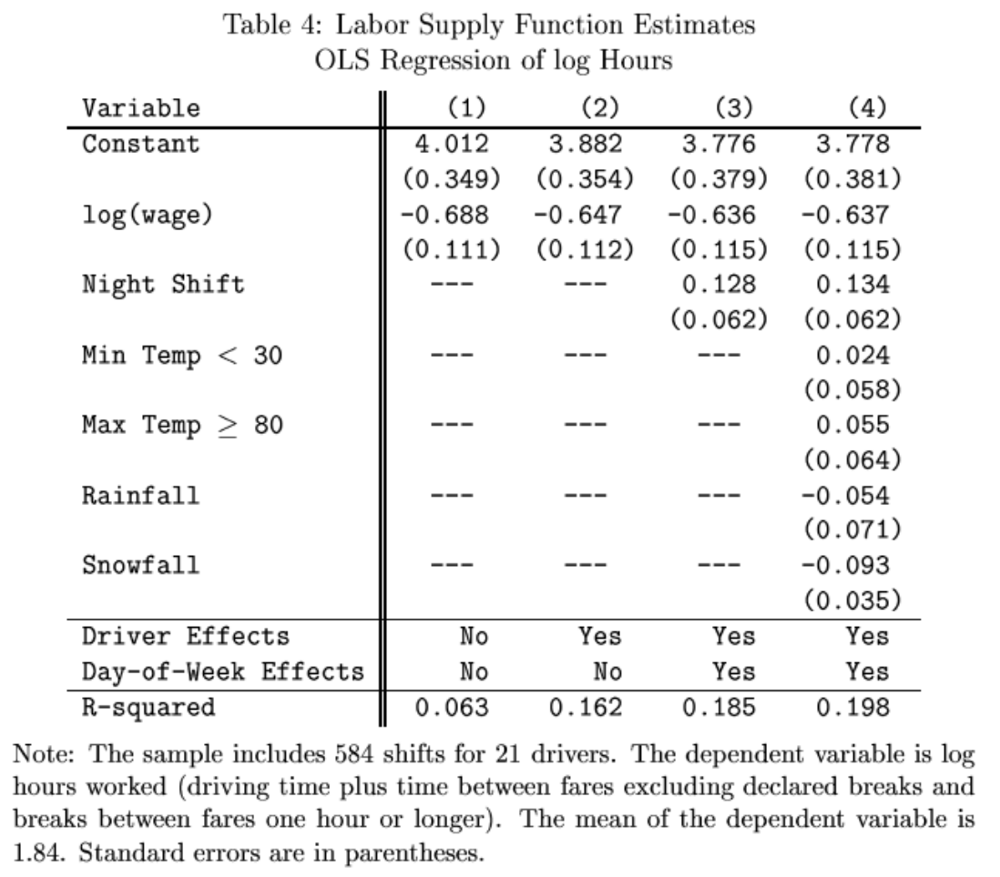

```{r setup, include=FALSE}
knitr::opts_chunk$set(echo = TRUE)
```

# Area under the curve, p-values
## Questions
### 1. (25 points) Please answer the following; you might find it useful to make a sketch.
  a. For a Normal Distribution that has mean -7 and standard deviation 7.1, what is the area to the right of 6.49?
  b. For a Normal Distribution that has mean 11 and standard deviation 4.1, what is the area to the right of 6.08?
  c. For a Normal Distribution that has mean 5 and standard deviation 3, what is the area to the left of 3.5?
  d. For a Normal Distribution that has mean -7 and standard deviation 3.8, what is the area to the left of 1.74?
  e. For a Normal Distribution that has mean -10 and standard deviation 5.1, what is the area to the left of -18.67?
  f. For a Normal Distribution that has mean -10 and standard deviation 3.4, what is the area in both tails farther from the mean than -12.04?
  g. For a Normal Distribution that has mean 8 and standard deviation 8.6, what is the area in both tails farther from the mean than -5.76?
  h. For a Normal Distribution that has mean 12 and standard deviation 2.2 , what is the area in both tails farther from the mean than 10.02 ?
  i. For a Normal Distribution that has mean -5 and standard deviation 1.3 what values leave probability 0.15 in both tails?
  j. For a Normal Distribution that has mean 11 and standard deviation 7.6 what values leave probability 0.782 in both tails?
  k. For a Normal Distribution that has mean 9 and standard deviation 3.1 what values leave probability 0.077 in both tails?
  l. A regression coefficient is estimated to be equal to 6.09 with standard error 8.7; there are 40 degrees of freedom.  What is the p-value (from the t-statistic) against the null hypothesis of zero?
  m. A regression coefficient is estimated to be equal to -20.16 with standard error 8.4; there are 34 degrees of freedom.  What is the p-value (from the t-statistic) against the null hypothesis of zero?
  n. A regression coefficient is estimated to be equal to 8.8 with standard error 4.4; there are 5 degrees of freedom.  What is the p-value (from the t-statistic) against the null hypothesis of zero?
  o. A regression coefficient is estimated to be equal to -17.64 with standard error 9.8; there are 11 degrees of freedom.  What is the p-value (from the t-statistic) against the null hypothesis of zero?


### 2. (20 points) Please answer the following; you might find it useful to make a sketch.
a. For a Normal Distribution that has mean -11 and standard deviation 6.6, what is the area to the right of -15.62?
b. For a Normal Distribution that has mean -5 and standard deviation 2.8, what is the area to the right of -9.48?
c. For a Normal Distribution that has mean 12 and standard deviation 4.7, what is the area to the left of 6.83?
d. For a Normal Distribution that has mean -1 and standard deviation 6.5, what is the area to the left of 4.85?
e. For a Normal Distribution that has mean 3 and standard deviation 8.6, what is the area in both tails farther from the mean than -9.9?
f. For a Normal Distribution that has mean 7 and standard deviation 0.6, what is the area in both tails farther from the mean than 6.04?
g. For a Normal Distribution that has mean -5 and standard deviation 9.8, what is the area in both tails farther from the mean than -5?
h. For a Normal Distribution that has mean 13 and standard deviation 9 what values leave probability 0.16 in both tails?
i. For a Normal Distribution that has mean -13 and standard deviation 7 what values leave probability 0.486 in both tails?
j. A regression coefficient is estimated to be equal to 2.6 with standard error 5.2; there are 33 degrees of freedom.  What is the p-value (from the t-statistic) against the null hypothesis of zero?
k. A regression coefficient is estimated to be equal to 20.47 with standard error 8.9; there are 9 degrees of freedom.  What is the p-value (from the t-statistic) against the null hypothesis of zero?


### 3. (20 points) Consider the following simple distribution questions.  Your answer can be as detailed as necessary.  You might sketch each case.
a. For a Normal Distribution with mean -1 and standard deviation 5.2, what is area to the right of -9.32?
b. For a Normal Distribution with mean -6 and standard deviation 7.2, what is area to the right of 2.64?
c. For a Normal Distribution with mean 15 and standard deviation 8, what is area to the left of -3.4?
d. For a Normal Distribution with mean -3 and standard deviation 0.5, what is area to the left of -2.1?
e. For a Normal Distribution with mean 11 and standard deviation 5.8, what is area in both tails farther from the mean than 19.12?
f. For a Normal Distribution with mean -9 and standard deviation 5.1, what is area in both tails farther from the mean than -1.86?
g. For a Normal Distribution with mean 11 and standard deviation 6.1 what values leave probability 0.357 in both tails?
h. For a Normal Distribution with mean 13 and standard deviation 4.3, what values leave probability 0.035 in both tails?
i. A regression coefficient is estimated to be equal to -5.25 with standard error 2.1; there are 12 degrees of freedom.  What is the p-value (from the t-statistic) against the null hypothesis of zero?
j. A regression coefficient is estimated to be equal to 5.88 with standard error 8.4; there are 13 degrees of freedom.  What is the p-value (from the t-statistic) against the null hypothesis of zero?
k. A regression coefficient is estimated to be equal to -4.5 with standard error 9; there are 3 degrees of freedom.  What is the p-value (from the t-statistic) against the null hypothesis of zero?

### 4. Consider the following simple distribution questions.  Your answer can be as detailed as necessary.  You might sketch each case.
a. For a Normal Distribution with mean 4 and standard deviation 3.6, what is area to the right of 1.48?
b. For a Normal Distribution with mean -1 and standard deviation 3.2, what is area to the left of 4.12?
c. For a Normal Distribution with mean -14 and standard deviation 6.2, what is area in both tails farther from the mean than -4.08?
d. For a Normal Distribution with mean 10 and standard deviation 0.6, what is area in both tails farther from the mean than 10.18?
e. For a Normal Distribution with mean -12 and standard deviation 3.3, what is area in both tails farther from the mean than -5.73?
f. For a Normal Distribution with mean -1 and standard deviation 6.3, what values leave probability 0.058 in both tails?
g. For a Normal Distribution with mean -1 and standard deviation 5.3, what values leave probability 0.225 in both tails?


### 5. You might find it useful to sketch the distributions.
a. If a variable has a Normal Distribution with mean 9 and standard deviation 9, what is area to the right of -8.3?
b. For a Normal Distribution with mean 5 and standard deviation 0.4, what is area to the left of 4.7?
c. For a Normal Distribution with mean 6 and standard deviation 0.3, what is area in both tails farther from the mean than 5.7?
d. For a Normal Distribution with mean -2 and standard deviation 3.8, what is area in both tails farther from the mean than 2.9?
e. For a Normal Distribution with mean 6 and standard deviation 7.5, what is area in both tails farther from the mean than -2.3?
f. For a Normal Distribution with mean 14 and standard deviation 3.4, what values leave probability 0.292 in both tails?
g. For a Normal Distribution with mean 8 and standard deviation 2.6, what values leave probability 0.253 in both tails?
h. For a Normal Distribution with mean -11 and standard deviation 2.6, what values leave probability 0.420 in both tails?
i. For a Normal Distribution with mean 2 and standard deviation 4.7, what values leave probability 0.007 in both tails?
j. For a Normal Distribution with mean -10 and standard deviation 7.9, what values leave probability 0.156 in both tails?
 
k. A regression coefficient is estimated to be equal to 1.902 with standard error 1.5; there are 26 degrees of freedom.  What is the p-value (from the t-statistic) against the null hypothesis of zero?
l. A regression coefficient is estimated to be equal to 12.942 with standard error 9.6; there are 8 degrees of freedom.  What is the p-value (from the t-statistic) against the null hypothesis of zero?
m. A regression coefficient is estimated to be equal to 3.647 with standard error 2.6; there are 15 degrees of freedom.  What is the p-value (from the t-statistic) against the null hypothesis of zero?
n. A regression coefficient is estimated to be equal to -5.130 with standard error 3.5; there are 17 degrees of freedom.  What is the p-value (from the t-statistic) against the null hypothesis of zero?
o. A regression coefficient has standard error 2.40; there are 14 degrees of freedom.  The t-statistic is 2.5994.  What is the coefficient?
p. A regression coefficient has standard error 3.40; there are 28 degrees of freedom.  The t-statistic is -1.4877.  What is the coefficient?
q. A regression coefficient has standard error 2.30; there are 12 degrees of freedom.  The t-statistic is -1.0175.  What is the coefficient?
r. A regression coefficient is estimated to be equal to 11.219; there are  7 degrees of freedom.  The t-statistic is 1.6259.  What is the standard error?

### 6. You might find it useful to make a sketch.
a. For a Normal Distribution with mean  1 and standard deviation 1.7, what is area in both tails farther from the mean than 1.9? A. 0.4013 B. 0.6915 C. 0.2630 D. 0.6171
b. For a Normal Distribution with mean  3 and standard deviation 4.7, what is area in both tails farther from the mean than -0.3? A. 0.7384 B. 0.9679 C. 0.2616 D. 0.4839
c. For a Normal Distribution with mean -7 and standard deviation 8.1, what is area in both tails farther from the mean than -17.5? A. 0. 2551 B. 0.1936 C. 0.7422 D. 0.3872
d. For a Normal Distribution with mean -4 and standard deviation 5.7, what is area in both tails farther from the mean than -16.0? A. 0.9821 B. 0.1587 C. 0.7586 D. 0.0357
e. For a Normal Distribution with mean -11 and standard deviation 5.7, what is area in both tails farther from the mean than -12.1? A. 0.5398 B. 0.8415 C. 0.5793 D. 0.9732
f. For a Normal Distribution with mean -10 and standard deviation 8.3, what is area in both tails farther from the mean than -8.3? A. 0.1141 B. 0.5793 C. 0.8859 D. 0.8415
g. For a Normal Distribution with mean 11 and standard deviation 0.8, what is area in both tails farther from the mean than 10.6? A. 0.4314 B. 0.1587 C. 0.6171 D. 0.5987
h. For a Normal Distribution with mean -3 and standard deviation 0.8, what is area in both tails farther from the mean than -4.0? A. 0.7422 B. 0.9032 C. 0.0001 D. 0.1936
i. For a Normal Distribution with mean -3 and standard deviation 1.0, what is area in both tails farther from the mean than -4.8? A. 0.9641 B. 0.1437 C. 0.8159 D. 0.0719
j. For a Normal Distribution with mean -15 and standard deviation 0.4, what is area in both tails farther from the mean than -15.7? A. 0.7317 B. 0.1783 C. 0.0891 D. 0.8023
k. For a Normal Distribution with mean  8 and standard deviation 0.8, what is area in both tails farther from the mean than 9.7? A. 0.7757 B. 0.1587 C. 0.1469 D. 0.0357
l. For a Normal Distribution with mean  1 and standard deviation 3.5, what values leave probability 0.469 in both tails? A. (-1.5344    3.5344) B. (0.7278    1.2722)  C. (6.3837   -4.3837)  D. (-0.4384    1.0098)
m. For a Normal Distribution with mean -8 and standard deviation 1.7, what values leave probability 0.114 in both tails? A. (-8.0494   -5.9506) B. (-10.6868   -5.3132) C. (-9.2673   -6.7327) D. (-6.2863   -3.1254)
n. For a Normal Distribution with mean -9 and standard deviation 9.0, what values leave probability 0.489 in both tails?  A. (-9.2482   -8.7518) B. (-15.2271   -2.7729) C. (-0.6919    0.6919)  D. (9.1268  -27.1268)
o. For a Normal Distribution with mean  3 and standard deviation 2.6, what values leave probability 0.301 in both tails?  A. (1.6554    4.3446)  B. (0.3108    5.6892)  C. (3.6722    2.3278)  D. (-1.0343    1.0343)
p. For a Normal Distribution with mean -5 and standard deviation 4.2, what values leave probability 0.254 in both tails? A. (-9.7909   -0.2091) B. (-1.1407    1.1407)  C. (-4.9158   -5.0842)  D. (-7.3954   -2.6046)
q. For a Normal Distribution with mean 13 and standard deviation 7.3, what values leave probability 0.244 in both tails?  A. (-2.0048   15.0048)  B. (12.7804   13.2196) C. (7.9375   18.0625)   D. (4.4952   21.5048)
r. For a Normal Distribution with mean  1 and standard deviation 5.2, what values leave probability 0.116 in both tails?  A. (-5.2152    7.2152)  B. (-7.1733    9.1733) C. (-7.6733    8.6733) D. (-3.0866    5.0866)
s. For a Normal Distribution with mean -4 and standard deviation 9.9, what values leave probability 0.020 in both tails? A. (-2.3263    2.3263) B. (-21.3318   13.3318) C. (-27.0308   19.0308) D. (-24.3321   16.3321)
t. For a Normal Distribution with mean -11 and standard deviation 7.2, what values leave probability 0.054 in both tails? A. (-19.3732    8.3732) B. (-22.5722    0.5722) C. (-24.8732    2.8732) D. (-17.9366   -4.0634)
u. For a Normal Distribution with mean 12 and standard deviation 8.9, what values leave probability 0.167 in both tails? A. (5.8505   18.1495) B. (8.1828   15.8172) C. (-0.2990   24.2990) D. (-1.3819    1.3819)
v. For a Normal Distribution with mean 12 and standard deviation 0.3, what values leave probability 0.245 in both tails? A. (11.9925   12.0075) B. (38.8374   41.1626) C. (11.6512   12.3488) D. (14.8256   18.1744)

### 7. You might find it useful to make a sketch.
a. A regression coefficient is estimated to be equal to -5.968 with standard error 4.7; there are  4 degrees of freedom.  What is the p-value (from the t-statistic) against the null hypothesis of zero? A. 1.7958 B. 0.5540 C. 0.2730 D. 0.7270
b. A regression coefficient is estimated to be equal to -9.880 with standard error 9.7; there are 21 degrees of freedom.  What is the p-value (from the t-statistic) against the null hypothesis of zero? A. 0.6830 B. 0.3200 C. 0.8694 D. 0.6500
c. A regression coefficient is estimated to be equal to -10.781 with standard error 6.6; there are 20 degrees of freedom.  What is the p-value (from the t-statistic) against the null hypothesis of zero? A. 0.1180 B. 0.0003 C. 0.2390 D. 0.9700
d. A regression coefficient is estimated to be equal to 4.456 with standard error 4.9; there are 12 degrees of freedom.  What is the p-value (from the t-statistic) against the null hypothesis of zero? A. 0.0060 B. 0.2346 C. 0.6190 D. 0.3810
e. A regression coefficient is estimated to be equal to 6.696 with standard error 4.2; there are 31 degrees of freedom.  What is the p-value (from the t-statistic) against the null hypothesis of zero? A. 0.1210 B. 1.8891 C. 0.8790 D. 0.6609
f. A regression coefficient is estimated to be equal to 32.530 with standard error 10.0; there are  7 degrees of freedom.  What is the p-value (from the t-statistic) against the null hypothesis of zero? A. 0.9860 B. 0.0140 C. 0.0017 D. 0.6991
g. A regression coefficient is estimated to be equal to -6.463 with standard error 4.8; there are  5 degrees of freedom.  What is the p-value (from the t-statistic) against the null hypothesis of zero? A. 0.0089 B. 1.8218 C. 0.2360 D. 0.8581
h. A regression coefficient is estimated to be equal to 7.335 with standard error 3.4; there are 19 degrees of freedom.  What is the p-value (from the t-statistic) against the null hypothesis of zero? A. 0.5060 B. 0.0440 C. 0.9560 D. 0.1750
i. A regression coefficient is estimated to be equal to -6.564 with standard error 3.1; there are  7 degrees of freedom.  What is the p-value (from the t-statistic) against the null hypothesis of zero? A. 0.0720 B. 0.9239 C. 0.9280 D. 0.1386
j. A regression coefficient is estimated to be equal to -8.619 with standard error 6.1; there are 25 degrees of freedom.  What is the p-value (from the t-statistic) against the null hypothesis of zero? A. 0.1493 B. 0.1700 C. 0.9500 D. 0.8300
k. A regression coefficient is estimated to be equal to 7.966 with standard error 8.8; there are 17 degrees of freedom.  What is the p-value (from the t-statistic) against the null hypothesis of zero? A. 0.3780 B. 0.6347 C. 0.8510 D. 0.2575
l. A regression coefficient is estimated to be equal to 10.254 with standard error 6.7; there are 26 degrees of freedom.  What is the p-value (from the t-statistic) against the null hypothesis of zero? A. 0.1380 B. 0.8620 C. 0.0965 D. 0.9352
m. A regression coefficient has standard error 4.60; there are 14 degrees of freedom.  The t-statistic is 1.3942.  What is the coefficient? A. 0.1376 B. 0.3357 C. 6.4132 D. 0.4581
n. A regression coefficient has standard error 4.70; there are  6 degrees of freedom.  The t-statistic is 1.7159.  What is the coefficient? A. 0.3849 B. 6.8630 C. 8.0647 D. 1.9138
o. A regression coefficient has standard error 4.30; there are 21 degrees of freedom.  The t-statistic is 1.1602.  What is the coefficient? A. 0.3331 B. 4.9887 C. 8.7410 D. 0.1866
p. A regression coefficient has standard error 6.60; there are 24 degrees of freedom.  The t-statistic is 1.5223.  What is the coefficient? A. 1.8721 B. 0.4186 C. 10.0472 D. 7.8590
q. A regression coefficient has standard error 5.40; there are 27 degrees of freedom.  The t-statistic is -1.6674.  What is the coefficient? A. -9.0038 B. 0.0954 C. 0.8930 D. 1.0433
r. A regression coefficient has standard error 1.10; there are  5 degrees of freedom.  The t-statistic is -3.1285.  What is the coefficient? A. -3.4414 B. -2.0018 C. 0.9740 D. 0.6120
s. A regression coefficient is estimated to be equal to 16.483; there are 10 degrees of freedom.  The t-statistic is 2.7937.  What is the standard error? A. 0.0102 B. 5.9000 C. 46.0716 D. 1.6483
t. A regression coefficient is estimated to be equal to -2.806; there are  8 degrees of freedom.  The t-statistic is -1.0394.  What is the standard error? A. 0.2986 B. 0.7436 C. -0.3508 D. 2.7000
u. A regression coefficient is estimated to be equal to -11.059; there are 11 degrees of freedom.  The t-statistic is -1.1641.  What is the standard error? A. 12.9570 B. -1.0054 C. 9.5000 D. 0.8512
v. A regression coefficient is estimated to be equal to 13.066; there are 25 degrees of freedom.  The t-statistic is 1.5743.  What is the standard error? A. 8.3000 B. 20.5795 C. 1.8846 D. 0.0831
w. A regression coefficient is estimated to be equal to 15.167; there are  6 degrees of freedom.  The t-statistic is 3.0333.  What is the standard error? A. 5.0000 B. 0.9770 C. 0.0076 D. 1.9976
x. A regression coefficient is estimated to be equal to 6.136; there are 28 degrees of freedom.  The t-statistic is 1.2271.  What is the standard error? A. 0.2191 B. 0.7700 C. 5.0000 D. 7.6024

### 8.  You might find it useful to sketch the distributions.
a. For a Normal Distribution with mean 1 and standard deviation 9.6, what is area in both tails farther from the mean than 23.1? A. 0.1251 B. 0.0214 C. 0.4585 D. 0.9893
b. For a Normal Distribution with mean 5 and standard deviation 7.6, what is area in both tails farther from the mean than 14.1? A. 0.2743 B. 0.1587 C. 0.2301 D. 0.4603
c. For a Normal Distribution with mean -2 and standard deviation 3.8, what is area in both tails farther from the mean than 2.9? A. 0.7007 B. 0.1936 C. 0.3872 D. 0.2578
d. For a Normal Distribution with mean -7 and standard deviation 5.1, what is area in both tails farther from the mean than -1.9? A. 0.3173 B. 0.0849 C. 0.6346 D. 0.9151
e. For a Normal Distribution with mean 13 and standard deviation 3.5, what is area in both tails farther from the mean than 7.8? A. 0.2672 B. 0.1336 C. 0.1587 D. 0.7734
f. For a Normal Distribution with mean -12 and standard deviation 9.6, what values leave probability 0.003 in both tails? A. (-2.9677, 2.9677) B. (-38.3787, 14.3787) C. (-36.1166, 12.1166) D. (-40.4903, 16.4903)
g. For a Normal Distribution with mean -2 and standard deviation 9.1, what values leave probability 0.092 in both tails? A. (-1.6849, 1.6849) B. (-17.3330, 13.3330) C. (-1.9047, 1.4652) D. (-16.3950, 14.3950)
h. For a Normal Distribution with mean  0 and standard deviation 4.0, what values leave probability 0.039 in both tails? A. (-5.6746, 5.6746) B. (-7.0496, 7.0496) C. (-2.0642, 2.0642) D. (-8.2567, 8.2567)
i. A regression coefficient is estimated to be equal to -12.684 with standard error 9.4; there are 16 degrees of freedom.  What is the p-value (from the t-statistic) against the null hypothesis of zero? A. 0.1960 B. 0.4810 C. 1.8228 D. 0.9323
j. A regression coefficient is estimated to be equal to 10.030 with standard error 4.0; there are  5 degrees of freedom.  What is the p-value (from the t-statistic) against the null hypothesis of zero? A. 0.2030 B. 0.3354 C. 0.0300 D. 0.0540
k. A regression coefficient is estimated to be equal to 0.559 with standard error 0.2; there are  3 degrees of freedom.  What is the p-value (from the t-statistic) against the null hypothesis of zero? A. 0.6797 B. 0.9320 C. 0.0680 D. 0.7121
l. A regression coefficient is estimated to be equal to -3.564 with standard error 1.9; there are 22 degrees of freedom.  What is the p-value (from the t-statistic) against the null hypothesis of zero? A. 0.2100 B. 0.0740 C. 0.8950 D. 0.9393


### 9. You might find it useful to sketch these.
a. For a Normal Distribution with mean  1 and standard deviation 9.6, what is area to the right of 23.1? A. 0.1251 B. 0.0107 C. 0.4585 D. 0.9893
b. For a Normal Distribution with mean  8 and standard deviation 4.9, what is area to the left of 6.5? A. 0.5596 B. 0.7642 C. 0.3821 D. 0.1587
c. For a Normal Distribution with mean  4 and standard deviation 7.1, what is area in both tails farther from the mean than 13.2? A. 0.1936 B. 0.3872 C. 0.2866 D. 0.1587
d. For a Normal Distribution with mean -11 and standard deviation 5.0, what is area in both tails farther from the mean than 0.5? A. 0.1251 B. 0.1587 C. 0.0429 D. 0.0214
e. For a Normal Distribution with mean 13 and standard deviation 3.5, what value leaves probability 0.197 in the left tail? A. 12.0588 B. 10.0166 C. 0.8030 D. 15.9834
f. For a Normal Distribution with mean -10 and standard deviation 2.6, what values leave probability 0.146 in both tails? A. (-1.4538, 1.4538) B. (-5.3000, -2.3923) C. (-13.7799, -6.2201) D. (-8.7799, -1.2201)
g. For a Normal Distribution with mean 12 and standard deviation 9.8, what values leave probability 0.220 in both tails? A. (-1.2265, 1.2265) B. (10.5205, 13.4795) C. (-0.0200, 24.0200) D. (4.4325, 19.5675)
h. A regression coefficient is estimated to be equal to -5.941 with standard error 3.9; there are  9 degrees of freedom.  What is the p-value (from the t-statistic) against the null hypothesis of zero? A. 0.1620 B. 0.8491 C. 0.1080 D. 0.3380
i. A regression coefficient is estimated to be equal to -10.249 with standard error 3.5; there are 26 degrees of freedom.  What is the p-value (from the t-statistic) against the null hypothesis of zero? A. 0.0966 B. 0.9930 C. 0.0070 D. 0.9999
j. A regression coefficient is estimated to be equal to 5.563 with standard error 3.0; there are 24 degrees of freedom.  What is the p-value (from the t-statistic) against the null hypothesis of zero? A. 0.9240 B. 0.0363 C. 0.1710 D. 0.0760

### 10. Answer  each question; you might find it useful to make a sketch.
a. A regression coefficient is estimated to be equal to -1.417 with standard error 1.6; there are 30 degrees of freedom.  What is the p-value (from the t-statistic) against the null hypothesis of zero? A. 0.9249 B. 0.7998 C. 0.6240 D. 0.3830
b. A regression coefficient is estimated to be equal to -15.901 with standard error 7.1; there are  3 degrees of freedom.  What is the p-value (from the t-statistic) against the null hypothesis of zero? A. 0.1110 B. 0.9749 C. 0.0001 D. 0.9065
c. A regression coefficient is estimated to be equal to -16.558 with standard error 7.1; there are  8 degrees of freedom.  What is the p-value (from the t-statistic) against the null hypothesis of zero? A. 0.9520 B. 0.1280 C. 0.0002 D. 0.0480
d. A regression coefficient is estimated to be equal to -0.322 with standard error 0.3; there are 29 degrees of freedom.  What is the p-value (from the t-statistic) against the null hypothesis of zero? A. 1.0000 B. 0.8378 C. 0.2920 D. 0.7080
e. A regression coefficient has standard error 7.50; there are  9 degrees of freedom.  The t-statistic is 1.3730.  What is the coefficient? A. 1.8302 B. 10.2972 C. 1.1441 D. 0.8282
f. A regression coefficient has standard error 2.00; there are  9 degrees of freedom.  The t-statistic is -1.2381.  What is the coefficient? A. -2.4762 B. 0.7321 C. 0.7530 D. -0.5836
g. A regression coefficient has standard error 3.40; there are 22 degrees of freedom.  The t-statistic is 2.0265.  What is the coefficient? A. 1.9573 B. 0.3132 C. 6.8903 D. 0.6075
h. A regression coefficient is estimated to be equal to -14.943; there are  4 degrees of freedom.  The t-statistic is -1.7176.  What is the standard error? A. 0.0411 B. 0.8390 C. 8.7000 D. 0.9358
i. A regression coefficient is estimated to be equal to -8.636; there are  4 degrees of freedom.  The t-statistic is -2.1590.  What is the standard error? A. 0.9473 B. 18.6638 C. 0.0150 D. 4.0000
j. A regression coefficient is estimated to be equal to 7.693; there are 16 degrees of freedom.  The t-statistic is 1.5699.  What is the standard error? A. 1.8836 B. 4.9000 C. 0.1057 D. 0.4808

### 11. Answer each question.  It might help to make sketches.
a. For a Normal Distribution with mean 9 and standard deviation 9.1, what is area in both tails farther from the mean than -8.3? A. 0.8387 B. 0.0574 C. 0.1587 D. 0.9713
b. For a Normal Distribution with mean 1 and standard deviation 9.6, what is area in both tails farther from the mean than 23.1? A. 0.1251 B. 0.0214 C. 0.4585 D. 0.9893
c. For a Normal Distribution with mean 5 and standard deviation 7.6, what is area in both tails farther from the mean than 14.1? A. 0.2743 B. 0.1587 C. 0.2301 D. 0.4603
d. For a Normal Distribution with mean -14 and standard deviation 2.8, what is area in both tails farther from the mean than -20.4? A. 0.0214 B. 0.8235 C. 0.0429 D. 0.0971
e. For a Normal Distribution with mean -2 and standard deviation 3.8, what values leave probability 0.382 in both tails? A. (-3.6610, -0.3390) B. (-5.3220, 1.3220) C. (0.7331, -4.7331) D. (-3.1409, -0.8591)
f.For a Normal Distribution with mean 13 and standard deviation 3.5, what values leave probability 0.099 in both tails? A. (10.0292, 15.9708) B. (7.2260, 18.7740)C. (0.5785, 12.2990) D. (8.4946, 17.5054)

### 12. Please answer the following questions.
a. A regression coefficient is estimated to be equal to 10.527 with standard error 8.3; there are 19 degrees of freedom.  What is the p-value (from the t-statistic) against the null hypothesis of zero? A. 0.2200 B. 1.7953 C. 0.1323 D. 0.7800
b. A regression coefficient is estimated to be equal to 0.521 with standard error 0.5; there are 17 degrees of freedom.  What is the p-value (from the t-statistic) against the null hypothesis of zero? A. 0.6380 B. 1.7026 C. 0.3120 D. 0.6988
c. A regression coefficient is estimated to be equal to 2.885 with standard error 1.7; there are 19 degrees of freedom.  What is the p-value (from the t-statistic) against the null hypothesis of zero? A. 0.2423 B. 0.2810 C. 0.9980 D. 0.1060
d. A regression coefficient is estimated to be equal to 1.902 with standard error 1.5; there are 26 degrees of freedom.  What is the p-value (from the t-statistic) against the null hypothesis of zero? A. 0.4410 B. 0.3363 C. 0.9714 D. 0.2160
e. A regression coefficient is estimated to be equal to -7.981 with standard error 4.3; there are 28 degrees of freedom.  What is the p-value (from the t-statistic) against the null hypothesis of zero? A. 0.2131 B. 0.1630 C. 0.9547 D. 0.9260
f. A regression coefficient has standard error 5.10; there are 14 degrees of freedom.  The t-statistic is -2.3978.  What is the coefficient? A. -0.8735 B. 0.9730 C. -0.4571 D. -12.2287
g. A regression coefficient has standard error 9.40; there are 16 degrees of freedom.  The t-statistic is -1.3494.  What is the coefficient? A. -12.6842 B. -0.0543 C. 0.1772 D. 0.8861
h. A regression coefficient is estimated to be equal to 4.873; there are 12 degrees of freedom.  The t-statistic is 0.9093.  What is the standard error? A. 5.3588 B. 0.2279 C. 0.4061 D. 0.7702
i. A regression coefficient is estimated to be equal to -4.488; there are  7 degrees of freedom.  The t-statistic is -1.8992.  What is the standard error? A. 0.8650 B. -0.6411 C. 0.0232 D. 2.3631

### 13. You might sketch a picture.
a. For a  Normal Distribution with mean 4 and standard deviation of 1, what is the area to the left of 3.3?  0.484  0.758  0.242  0.363
b. For a  Normal Distribution with mean -13 and standard deviation of 7, what is the area to the left of -3.2?  0.162  0.081  0.919  0.758
c. For a  Normal Distribution with mean 1 and standard deviation of 4, what is the area to the right of -6.6?  0.829  0.029  0.971  0.057
d. For a  Normal Distribution with mean -6 and standard deviation of 2, what is the area to the right of -9.8?  0.057  0.829  0.029  0.971
e. For a  Normal Distribution with mean -3 and standard deviation of 5, what is the area to the right of -8?  0.691  0.317  0.841  0.159
f. For a  Normal Distribution with mean -12 and standard deviation of 5, what is the area in both tails farther from the mean (in absolute value) than -21.5?       0.057     0.029     0.971    0.351
g. For a  Normal Distribution with mean -9 and standard deviation of 5, what is the area in both tails farther from the mean (in absolute value) than -10?        0.579    0.421       0.841    0.087
h. For a  Normal Distribution with mean -13 and standard deviation of 8 what value leaves 0.22 in the right tail?  -3.188  -3.607  -8.303  -11.792  
i. For a  Normal Distribution with mean -7 and standard deviation of 5 what value leaves 0.24 in the right tail?  -4.026  -6.749  -1.052  -1.125  
j. For a  Normal Distribution with mean 12 and standard deviation of 2 what value leaves 0.03 in the right tail?  15.110  16.340  13.024  14.048  

### 14. You might sketch a picture.
a. For a  t Distribution with sample average of 1.43, standard error of 1.22, and 11 observations, what is the area in both tails, for a null hypothesis of zero mean?        0.133       0.181    0.412       0.266   
b. For a  t Distribution with sample average of 2.9, standard error of 1.82, and 13 observations, what is the area in both tails, for a null hypothesis of zero mean?      0.068       0.541       0.012      0.135   
c. For a  t Distribution with sample average of 3.31, standard error of 2.16, and 9 observations, what is the area in both tails, for a null hypothesis of zero mean?     0.009    0.160       0.530      0.080   
d. For a  t Distribution with sample average of 1.47, standard error of 1.47, and 16 observations, what is the area in both tails, for a null hypothesis of zero mean?       0.332     0.166       0.332       0.161
e. For a  t Distribution with 20 observations and standard error of 2.53, what sample mean leaves 0.08 in the two tails, when testing a null hypothesis of zero?       0.922       1.844       3.689    4.666   
f. For a  t Distribution with 5 observations and standard error of 2.78, what sample mean leaves 0.2 in the two tails, when testing a null hypothesis of zero?        0.738      1.476       4.103       2.952
g. For a  t Distribution with 20 observations and standard error of 0.53, what sample mean leaves 0.24 in the two tails, when testing a null hypothesis of zero?       1.211       0.606      0.642       2.422
h. Sample A has mean 4.28, standard error of 0.21, and 4 observations.  Sample B has mean 4.99, standard deviation of 0.33, and 23 observations.  Test the null hypothesis of no difference.       0.005       0.002       0.906    0.517   
i. Sample A has mean 1.6, standard error of 0.68, and 9 observations.  Sample B has mean 4.83, standard deviation of 2.81, and 9 observations.  Test the null hypothesis of no difference.        0.360    0.009        0.010       0.004  

### 15. You might sketch a picture.
a. For a Normal Distribution with mean  9 and standard deviation 9.1, what is area to the right of -8.3? A. 0.8387 B. 0.9713 C. 0.1587 D. 0.0287
b. For a Normal Distribution with mean  1 and standard deviation 9.6, what is area to the right of 23.1? A. 0.1251 B. 0.0107 C. 0.4585 D. 0.9893
c. For a Normal Distribution with mean 12 and standard deviation 7.9, what is area to the right of 30.2? A. 0.1587 B. 0.9893 C. 0.9356 D. 0.0107
d. For a Normal Distribution with mean  5 and standard deviation 7.6, what is area to the right of 14.1? A. 0.2743 B. 0.1587 C. 0.1151 D. 0.2301
e. For a Normal Distribution with mean -14 and standard deviation 2.8, what is area to the left of -20.4? A. 0.0107 B. 0.8235 C. 0.0214 D. 0.0971
f. For a Normal Distribution with mean -2 and standard deviation 3.8, what is area to the left of 2.9? A. 0.7007 B. 0.9032 C. 0.1936 D. 0.2578
g. For a Normal Distribution with mean  4 and standard deviation 7.1, what is area to the left of 13.2? A. 0.9032 B. 0.1936 C. 0.2866 D. 0.1587
h. For a Normal Distribution with mean -11 and standard deviation 5.0, what is area to the left of 0.5? A. 0.1251 B. 0.1587 C. 0.0214 D. 0.9893
i. For a Normal Distribution with mean -7 and standard deviation 5.1, what is area in both tails farther from the mean than -1.9? A. 0.3173 B. 0.0849 C. 0.6346 D. 0.9151
j. For a Normal Distribution with mean 13 and standard deviation 3.5, what is area in both tails farther from the mean than 7.8? A. 0.2672 B. 0.1336 C. 0.1587 D. 0.7734
k. For a Normal Distribution with mean 10 and standard deviation 5.9, what is area in both tails farther from the mean than 11.2? A. 0.8415 B. 0.4602 C. 0.1587 D. 0.5793
l. For a Normal Distribution with mean  1 and standard deviation 7.8, what is area in both tails farther from the mean than 18.2? A. 0.0278 B. 0.9861 C. 0.1587 D. 0.1357
m. For a Normal Distribution with mean -5 and standard deviation 1.6, what value leaves probability 0.794 in the left tail? A. NaN B. 0.2060 C. -3.6874 D. 0.8204
n. For a Normal Distribution with mean -7 and standard deviation 6.5, what value leaves probability 0.689 in the left tail? A. -3.7954 B. -5.3977 C. -10.2046 D. 0.4930
o. For a Normal Distribution with mean 12 and standard deviation 1.5, what value leaves probability 0.825 in the left tail? A. 0.1750 B. 13.4019 C. 8.9346 D. 0.9346
p. For a Normal Distribution with mean -12 and standard deviation 9.6, what value leaves probability 0.006 in the left tail? A. -2.5121 B. 12.1166 C. -33.6684 D. -36.1166
q. For a Normal Distribution with mean -2 and standard deviation 9.1, what value leaves probability 0.182 in the right tail? A. 0.9078 B. 6.2607 C. -1.1275 D. 0.8180
r. For a Normal Distribution with mean  0 and standard deviation 4.0, what value leaves probability 0.077 in the right tail? A. -4.0777 B. -5.7022 C. 1.4255 D. 5.7022
s. For a Normal Distribution with mean 13 and standard deviation 4.9, what value leaves probability 0.489 in the right tail? A. 13.1351 B. 0.0276 C. 12.9324 D. 12.8649
t. For a Normal Distribution with mean -3 and standard deviation 1.0, what value leaves probability 0.133 in the right tail? A. 1.1123 B. -3.6250 C. -4.1123 D. -1.8877


### 16. More normal caluculations
Calculate the probability in the following areas under the Normal pdf with mean and standard deviation as given.  You might usefully draw pictures as well as making the calculations.  For the calculations you can use either a computer or a table.
a. What is the probability, if the true distribution has mean -15 and standard deviation of 9.7, of seeing a deviation as large (in absolute value) as -1?
b. What is the probability, if the true distribution has mean 0.35 and standard deviation of 0.16, of seeing a deviation as large (in absolute value) as 0.51?
c. What is the probability, if the true distribution has mean -0.1 and standard deviation of 0.04, of seeing a deviation as large (in absolute value) as -0.16?


### 17. Standard Normal
A random variable is distributed as a standard normal.  (You are encouraged to sketch the PDF in each case.)
a. What is the probability that we could observe a value as far or farther than 1.3?
b. What is the probability that we could observe a value nearer than 1.8?
c. What value would leave 10% of the probability in the right-hand tail?
d. What value would leave 25% in both the tails (together)?


### 18. Standard Normal 
A random variable is distributed as a standard normal.  (You are encouraged to sketch the PDF in each case.)
a. What is the probability that we could observe a value as far or farther than -0.9?
b. What is the probability that we could observe a value nearer than 1.4?
c. What value would leave 5% of the probability in the right-hand tail?
d. What value would leave 5% in both the tails (together)?

## Solutions

# Data analysis from given data
## Questions
### 1. Correlations, Hypothesis Tests (20 points)
A recent research paper, looking at how much attractiveness and personal grooming affects wages, used data from The
National Longitudinal Study of Adolescent Health in 2001-2.

a. Are there gender differences? Among the 6074 people (48.4% female), 38.8% of the males were rated as being well groomed
or very well groomed; 50.6% of the females were rated that way. Is this a statistically significant difference?
b. The study considers interrelations between physical attractiveness and grooming. People were ranked on a 4-point scale
(where 1 is below average, 2 is average, 3 is above average, and 4 is very much above average) for each attribute. The full
details are:

##### Physically

|                               | 4 Very Attractive | 3 Attractive | 2 Average | 1 Less Attractive |
|-------------------------------|-------------------|--------------|-----------|-------------------|
| 4 Very well groomed           | 297               | 199          | 57        | 30
| 3 Well groomed                | 290               | 1169         | 607       | 54
| 2 Average grooming            | 75                | 788          | 2013      | 167
| 1 Less than average grooming  | 1                 | 25           | 164       | 138

c. Conditional on a person being ranked physically 3 or 4 in attractiveness (above average), what is the chance that they are above average (3 or 4) in grooming as well. Conditional on being above average physically, what is the chance that they are average or below average (1 or 2) in grooming? Are these statistically significantly different?
The study also considers the attractiveness of someone's personality (charisma), with the same 4-point scale. These data are:

##### Personality

|                               | 4 Very Attractive | 3 Attractive | 2 Average | 1 Less Attractive |
|-------------------------------|-------------------|--------------|-----------|-------------------|
| 4 Very well groomed           | 326               | 171          | 60        | 26
| 3 Well groomed                | 416               | 1186         | 467       | 51
| 2 Average grooming            | 212               | 966          | 1729      | 136
| 1 Less than average grooming  | 11                | 49           | 184       | 84
         
d. Conditional on having an above-average personality, what is the chance that someone has above-average grooming? Conditional on having an above-average personality, what is the chance that their grooming is at or below average? Is there a statistically significant difference?
e. Comment on the study. If overall attractiveness is a combination of these 3 factors, is there evidence that they are gross substitutes or complements in production?

*PK Robins, JF Homer, MT French (2011). "Beauty and the Labor Market: Accounting for the Additional Effects of Personality and
Grooming,"" Labour, 25(2), pp 228-251.*


### 2. Fill in the blank regression summary
Consider the following table of regression coefficients explaining wage and salary as a function of the given variables with heteroskedasticity-consistent Eicker-Huber-White standard errors.  Fill in the blanks.  There are 47,528 degrees of freedom with this data from CPS. (I used a random subset so don't try to re-estimate.)

|               | Estimate   | Std. Error | t value  | Pr(>| t|) |
|---------------|------------|------------|---------|-----------|
| (Intercept)    | -60367     | _____      | -6.45    | <0.01     |
| female        | 27009       | 11333      | _____   |  _____     |
| Age            | _____       | 503        | 7.99    | <0.01     |
| Age2          | -38        |   6          | _____   | _____     |
| female*Age    | -1949       | _____      | -3.19   | _____     |
| female*Age2   |  _____       | 8          | 2.4     | 1          |
| AfAm          | -8953       | 676        | _____   | _____     |
| Asian          | -1740       | _____      | -1.26   | 0.21      |
| Amindian      |  _____       | 3835        | 0.23    | 0.82      |
| race_oth      | -3882       | 1611        | _____   | _____     |
| Hispanic      | -7042       | _____      | -7.01    | <0.01     |
| married        | 5322       | 635        | 8.39    | <0.01     |
| divwidsep      | 150         | 889        | _____   | _____     |
| union_m        | -2052       | 1701        | _____   | _____     |
| veteran        | -1063       | 1325       | _____   | _____     |
| immigrant      | -5829       | _____      | -4.31    | <0.01     |
| immig2gen      | _____       | 1293        | 4.00    | <0.01     |
| educ_hs        | 9408       | 855        | 11.01    | <0.01     |
| educ_smcoll   |  18135       | 979        | 18.52    | <0.01     |
| educ_as        | 19349       | 996        | 19.43    | <0.01     |
| educ_bach      | 39289       | 1013        | 38.77    | <0.01     |
| educ_adv      | 66908       | 1575        | 42.49    | <0.01     |


### 3. Farber
A paper by Farber examined the choices of how many hours a taxidriver would work, depending on a number of variables. His output is:
"Driver Effects" are fixed effects for the 21 different drivers.



a. What is the estimated elasticity of hours with respect to the wage?
b. Is there a significant change in hours on rainy days? On snowy days?


### 4. 
In estimating how much choice of college major affects income, Hamermesh & Donald (2008) send out surveys to college alumni.  They first estimate the probability that a person will answer the survey with a probit model.  They use data on major (school of education is the omitted category), how long ago the person graduated, and some information from their college record.  Their results are (assume that the b0 coefficient is 0.253):

|                                 | pr(respond to survey) | t-statistic
| Architecture and Fine Arts     | -0.044  | 1.61
| Business---general             |  0.046  | 1.72
| Business---quantitative         | 0.038  | 1.45
| Communications                 | 0.023  | 1.00
| Engineering                     | 0.086  | 2.51
| Humanities                     | -0.013  | 0.54
| "Honors"                       | 0.087  | 2.08
| Social Sciences                 | 0.052  | 2.28
| Natural Sciences, Pharmacology |  0.04  | 1.52
| Nursing, Social Work           | 0.061  | 1.57
| Class of 1980                   | 0.025  | 1.61
| Class of 1985                  | -0.009  | 0.61
| Class of 1990                  | 0.041  | 2.65
| Class of 1995                  | 0.033  | 2.20
| GPA                            | 0.027  | 2.59
| Upper Div. Sci. & Math Credits | 0.0001  | 0.21
| Upper Div. Sci. & Math Grades  | 0.002  | 0.51
| HS Area Income ($000)           | 0.001  | 1.92
| Female                         | 0.031  | 3.06

a. What is the probability of reply for a major in quantitative Business, from the Class of 1995, with a GPA of 3.1, with 31 upper-division Science & Math credits, with a 2.9 GPA within those upper-division Science & Math courses, from a high school with a 40 HS Area Income?  How much more or less is the probability, if the respondent is female?


### 5. 
Using the BRFSS 2009 data, the following table compares the reported health status of the respondent with whether or not they smoked (defined as having at least 100 cigarettes) 

|                       | SMOKED AT LEAST 100 CIGARETTES?      |
|-----------------------|-------------------------------------|

|-----------------------|---------|---------|-----------------|
                        |  Yes    | No      | Marginal
| GENERAL HEALTH        |         |         |              
| Excellent             | 27775    | 49199    | ____
|  Very good            | 58629    | 77357    | ____
|  Good                 | 64237    | 67489    | ____
|  Fair                 | 31979    | 26069    | ____
|  Poor                 | 15680    | 9191    | ____
|  Marginal             | ____     | ____    |

a. What is the median health status for those who smoked?  For non-smokers?
b. Fill in the marginal probabilities – make sure they are probabilities. 
c. Explain what you might conclude from this data.


### 6. Regression fill in the blank
Using the CPS 2010 data (you don't need to download it for this), restricting attention to only prime-age (25-55 year-old) males reporting a non-zero wage and salary, the following regression output is obtained for a regression (including industry, occupation, and state fixed effects) with log wage and salary as the dependent variable.  
a. (17 points) Fill in the missing values in the table.
b. (3 points) Critique the regression: how would you improve the estimates (using the same dataset)?

| Model		     | Sum of Squares	| df	  | Mean Square	| F	      Sig.
| Regression	 | 11194.359	    | 145	  | 77.202	    | 127.556	.000
| Residual	   | 21558.122	    | 35619	| .605	      | _____	  _____
| Total	       | 32752.482	    | 35764	| _____	      | _____	  _____

| Model                                           | B        | Std Error | Beta  | t        | Sig.  |
|-------------------------------------------------|----------|-----------|-------|----------|-------|
| 1  (Constant)                                   | 8.375    | .112    | ____    |  74.714  |  .000 |
|  Demographics, Age                              | .078     | .005    | .705    |  ____    |  ____ |
|  Age squared                                    | -.00085  | .00006  | -.617   |  ____    |  ____ |
|  African American                               | -.184    | .015    | -.058   |  ____    |  ____ |
|  Asian                                          | ____     | .022    | -.025   |  -4.620  |  .000 |
|  Native American Indian or Alaskan or Hawaiian  | ____     | .027    | -.025   |  -5.674  |  .000 |
|  Hispanic                                       | -.051    | ____    | -.020   |  -2.172  |  .030 |
|  Mexican                                        | -.021    | ____    | -.007   |  -.868   |  .386 |
|  Puerto Rican                                   | .014     | ____    | .002    |  .319    |  .750 |
|  Cuban                                          |  .007    | .059    | .001    |  ____    |  ____ |
|  Immigrant                                      | -.094    | .019    | -.039   |  ____    |  ____ |
|  1 or more parents were immigrants              | .001     | .018    | .001    |  ____    |  ____ |
|  Education: High School Diploma                 | .219     | ____    | .105    |  13.582  |  .000 |
|  Education: Some College but no degree          | .333     | ____    | .130    |  18.332  |  .000 |
|  Education: Associate in vocational             | .362     | ____    | .081    |  14.919  |  .000 |
|  Education: Associate in academic               | ____     | .025    | .080    |  14.642  |  .000 |
|  Education: 4-yr degree                         | ____     | .019    | .236    |  28.773  |  .000 |
|  Education: Advanced Degree                     | ____     | .023    | .253    |  33.757  |  .000 |
|  Married                                        | ____     | .011    | .140    |  25.219  |  .000 |
|  Divorced or Widowed or Separated               | ____     | .016    | .021    |  3.992   |  .000 |
|  Union member                                   | ____     | .030    | .031    |  7.168   |  .000 |
|  Veteran since Sept 2001                        | -.047    | .094    | -.002   |  ____    |  ____ |
|  Veteran Aug 1990 - Aug 2001                    | -.053    | .038    | -.006   |  ____    |  ____ |
|  Veteran May 1975-July 1990                     | .035     | .048    | .003    |  ____    |  ____ |
|  Veteran August 1964-April 1975                 | .078     | .129    | .003    |  ____    |  ____ |


### 7. Regression fill in the blank
Consider the following regression output, from a regression of log-earnings on a variety of socioeconomic factors.  Fill in the blanks in the "Coefficients" table.  Then calculate the predicted change in the dependent variable when Age increases from 25 to 26; then when Age changes from 55 to 56 (note that Age_exp2 is Age2 and Age_exp3 is Age3).

| Model	| R	   | R Square	 | Adjusted R Square | Std. Error of the Estimate
|-------|------|-----------|-----------|------------|
| 1	    | .613 |	.376	   | .376	             |  .94098

|  	         | Sum of Squares	| df	    | Mean Square	 | F	        | Sig.
|------------|----------------|---------|--------------|------------|----------|
| Regression | 53551.873	    | 26	    | 2059.687	   |  2326.152	| .000(a)
| Residual	 | 88995.531	    | 100509	| .885	 	     |
| Total	     | 142547.403     | 100535  |	 	 	         |

        Unstandardized Coefficients		Standardized Coefficients
| Model	                           | B	        | Std. Error |	Beta |	t    | Sig.	
|----------------------------------|------------|------------|-------|-------|---------
|	Constant)	                       | 3.841	    | 0.059	  |  65.581	   | 0.000	
| Education: High School Diploma	 | 0.106	    | 0.008	  |  0.040305  | __?__	 | __?__	
| Education: AS vocational	       | __?__	    | 0.015	  |  0.051999  | 19.644	 | 0.000	
| Education: AS academic	         | 0.344	    | __?__	  |  0.062527  | 23.574	 | 0.000	
| Education: 4 year College Degree |	0.587	    | 0.009	  |  0.195326  | 65.257	 | 0.000	
| Education: Advanced Degree	     | 0.865	    | 0.011	  |  0.221309  | 77.658	 | 0.000	
| geog2	                           | 0.070	    | 0.013	  |  0.017072  | 5.220	 | 0.000	
| geog3	                           | 0.005	    | 0.013	  |  0.001232  | __?__	 | __?__	
| geog4	                           | -0.050	    | 0.013	  |  -0.01345  | __?__	 | __?__	
| geog5	                           | 0.062	    | 0.012	  |  0.019974  | __?__	 | __?__	
| geog6	                           | -0.061	    | 0.017	  |  -0.01039  | __?__	 | __?__	
| geog7	                           | 0.026	    | 0.014	  |  0.006106  | __?__	 | __?__	
| geog8	                           | 0.056	    | 0.013	  |  0.014445  | 4.303	 | 0.000	
| geog9	                           | 0.102	    | 0.012	  |  0.030892  | 8.357	 | 0.000	
| Married	                         | __?__	    | 0.009	  |  0.062911  | 17.213	 | 0.000
| Widowed	                         | __?__	    | 0.025	  |  -0.00191  | -0.697	 | __?__
| Divorced or Separated	           | __?__	    | 0.012	  |  0.022796  | 7.042	 | 0.000
| female	                         |  __?__	    | 0.006	  |  -0.19408  | -76.899 | 0.000
| union	                           |  0.208	    | __?__	  |  0.024531  | 9.808   | 0.000
| hispanic       	                 | -0.106	    | __?__	  |  -0.03211  | -12.012 | 0.000
| Af_Amer	                         | -0.038	    | __?__	  |  -0.00995  | -3.774	 | 0.000
| NativAm	                         | -0.100	    | __?__	  |  -0.01342  | -5.322	 | 0.000
| AsianAm	                         | -0.061	    | __?__	  |  -0.01147  | -4.420	 | 0.000
| MultRace	                       |  0.001	    | 0.066	  |  1.93E-05  | 0.008	 | __?__
| Demographics, Age	               |  0.377	    | 0.005	  |  4.332516  | 83.265	 | 0.000	
| Age_exp2	                       | -0.00689	  | 0.00011	| -6.70717  | -65.345	 | 0.000	
| Age_exp3	                       |  0.0000384 | 0.0000008	| 2.65889  | 49.301	 | 0.000	

Dependent variable: ln_earn


### 8. Effects of Divorce
A paper by Gruber looks at the effects of divorce on children (once they become adults), including whether there was an increase or decrease in education and wages.  Gruber uses data on state divorce laws: over time some states changed their laws to make divorce easier (no-fault or unilateral divorce).  Why do you think that he used state-level laws rather than the individual information (which was in the dataset) about whether a person's parents were divorced?  Is it important that he documents that states with easier divorce laws had more divorces?  If he ran a regression that explained an adult's wage on the usual variables, plus a measure of whether that person's parents had been divorced, what complications might arise?  Explain.
### 9. Cuddly Animals
A Japanese study looked at the effect of "kawaii" (cute) on test performance.  (I am inferring numbers from the graphs shown so these might not exactly match the study!)  There were 24 subjects; half were shown pictures of cute baby animals and half were shown pictures of full-grown animals (not cute).  The ability to complete tasks, for those shown cute pictures, changed by 4, with a standard deviation of 3.5.  The ability to complete tasks, for the control group, changed by 0.5 with a standard deviation of 2.9.  What is the difference in means?  What is the standard error of the difference? What is the normalized value for the difference?  What are the degrees of freedom?  What is the p-value?  Is this difference statistically significant?  Comment on the study. Should you immediately Google images of cute baby animals to help the rest of your exam performance?
*Nittono H, Fukushima M, Yano A, Moriya H (2012) The Power of Kawaii: Viewing Cute Images Promotes a Careful Behavior and Narrows Attentional Focus. PLoS ONE 7(9): e46362.*


### 10. Servers and their effect on consumption
An experiment in a bar recorded the amount of alcohol ordered, depending whether the waitress put her hand on the shoulder of the first patron while asking if he wanted a drink.  There were 24 pairs of men drinking together; 12 were touched and 12 were not.  When the waitress touched one, the average amount drunk by the man touched was 36 oz (standard deviation is 6) and the other man in the group drank 29.6 oz (std. dev. 5).  When the waitress did not touch either man, they drank 30.6 (std. dev. 5) and 26.6 oz (std. dev. 5).  The units are beer-equivalent ounces.  [The standard errors were not explicitly reported in the study, I'm making them up.] (Kaufman & Mahoney, J Social Psychology, 1999)
a. There are two slightly different effects: what is the effect of touching a patron on the shoulder, and what is the effect on the second man who sees his drinking buddy get a touch on the shoulder?  What is the standard error of the difference in consumption of the first man in each group (who was actually touched)?  What is the t-stat for the null hypothesis test that there was no difference in drinking quantity?  P-value?  Should the alternative hypothesis be one-sided or two-sided?
b. What is the standard error of the difference in consumption of the second man in each group?  What are the t-stat and p-value?  Should the alternative hypothesis be one-sided or two-sided?  Explain the null hypothesis and your conclusions.


### 11. Likeliness to lie
A study examined whether people were more likely to lie by email or in person, finding in a study of business students that 24 out of 26 lied when writing an email while 14 out of 22 lied when writing on paper.  (The lie was in the context of a fictitious business transaction.)  (Naquin, Kurtzberg, Belkin 2010 J Applied Psychology)
a. What is the standard error of the fraction of people lying by email?  What is the standard error of the fraction of people lying on paper?
b. What are the t-stat and p-value for the null hypothesis that the medium of communication (email or paper) had no effect on the probability of lying?  


### 12. FRED data
We use the most recent data to assess the relation between changes in GDP and changes in the unemployment rate (so-called Okun's Law), comparing the relation in the entire period since 1948 with the relation in the period since 1990.  Data are from FRED Stats.  A regression has the dependent variable as the quarterly change in the unemployment rate (denoted $\Delta UR$).  The independent variable is the quarterly percent growth rate of nominal GDP (denoted $\% \Delta Y$).  The estimated regression is $\Delta UR = \beta_0 + \beta_1 \% \Delta Y + u$.  
a. Using data for the entire period, 1948-2012, the estimated equation is $\Delta UR = 0.37 – 0.22\% \Delta Y$, where the standard error of the intercept is 0.03, the standard error of the slope is 0.02, and the R2 is 0.39.  Is the slope coefficient statistically significant? What is its t-statistic?  P-value?
b. Using data for the period 1990-2012, the estimated equation is  $\Delta UR = 0.38 – 0.30\% \Delta Y$, where the standard error of the intercept is 0.05, the standard error of the slope is 0.04, and the R2 is 0.45.  Is the slope coefficient statistically significant? What is its t-statistic?  P-value?
c. Compare the two regressions.  What are the arguments in favor of using the whole sample versus only more recent data?
d. For the most recent data (first quarter of 2012), GDP growth was 0.93 while UR was -0.4.  What was the predicted value from each model for that time?  How would you interpret this?


### 13. Kevin Needs Money
Suppose I were to start a hedge fund, called KevinNeedsMoney Limited Ventures, and I want to present evidence about how my fund
did in the past. I have data on my fund's returns, Rett, at each time period t, and the returns on the market, Mktt. The graph below
shows the relationship of these two variables:


a. I run a univariate OLS regression, $Ret_t = \beta_0 + \beta_1 Mkt_t + u_t$. Approximately what value would be estimated for the intercept term, $\beta_0$? For the slope term, $\beta_1$?
b. How would you describe this fund's performance, in non-technical language - for instance if you were advising a retail investor
without much finance background?


### 14. Guessing on the exam 
Suppose a student is answering 50 multiple-choice questions on an exam where each question has 4 choices.
a. If the student guesses randomly, what is the expected number of correct answers?  If the questions are worth 2 points each, what is the expected score for a student who is completely ignorant?
b. If a student guesses randomly, what is the standard error of the fraction guessed correctly?
c. What is a 95% confidence interval for scores of students who guess randomly?
d. If a student scores 27 points, what is the probability that the student was guessing randomly?

### 15. Fill in the blank
A study of Quantitative Easing in Japan (Kobayashi, Spiegel, and Yamori 2006) looked at the stock prices of particularly indebted firms to see if they were disproportionately impacted by the Bank of Japan's easy money policy. They report the following (49 Observations and R2=0.08):

| 	          | Estimate  |	 T-Statistic  |	 P-Value  |
|-------------|-----------|---------------|-----------|
| Capital  	  | -0.03  	  |  -1.879  	    |           |
| Liquidity  	| -0.51  	  |  -0.929  	    |           |
| Bad Loan  	| -0.00  	  |  -0.066  	    |           |

Where the "Capital" is the capital-asset ratio of the firm's main bank; "Liquidity" is its main bank's ratio of cash, reserves, and loan balances to assets; and "Bad Loan" is the ratio of nonperforming loans to total assets.
What are the p-values for each T-statistic?
Which regressors are statistically significant?
What does this imply?

### 16. 
Peter Gordon, in his talk at CCNY, presented results from linear regressions to explain the growth of metropolitan areas.  He begins with a simple model to explain population growth from 1990-2000:

#### Log Population Growth 1990-2000		
| 	                         | Coefficient	| t-stat	| p-value   |
|----------------------------|--------------|---------|-----------|
| Constant term	             | -0.0229    	| -0.12	  | 
| Population in 1990 (log)	 | 0.0192	      | 1.33	  | 
| Pop. Density in 1990	     | -0.0504    	| -1.65	  | 
| % in manufacturing	       | -0.0028	    | -1.63	  | 
| $R^2$                      |	0.57		    |         |

Where he also includes dummy variables for Census Regions (New England, Mid Atlantic, etc.).  There are 79 observations and 67 degrees of freedom.
a. What are the p-values for the 3 coefficients?  Are they significant?
b. The averages and standard deviations are:


|                           |	Average	| Standard deviation |
|---------------------------|---------|--------------------|
| Population in 1990 (log)	| 14.52	  | 14.89              |
| Pop. Density in 1990	    | 1.80	  | 1.02               |
| % in manufacturing	      | 18.69	  | 7.75               |

c. What is the predicted population growth for a metropolitan area that is exactly average?
d. What is the predicted population growth for a metro area that is one standard deviation above average in 1990 population?  For a metro area one standard deviation above average in density?  In manufacturing concentration?
e. Give a careful explanation for why we would observe coefficients of these signs.  


### 17. 

You are given the following data on the number of people in the PUMS sample who live in each of the five boroughs of NYC and who commute in each specified manner (where 'other' includes walking, working from home, taking a taxi or ferry or rail).

| 	      | Bronx |	Manhattan	| Staten Is	| Brooklyn | Queens |
|---------|-------|-----------|-----------|----------|--------|
| car   	| 5788	| 2692	    | 5526	    | 10990	   | 16905
| bus	    | 3132	| 2789	    | 1871	    | 4731	   | 4636
| subway	| 6481	| 13260	    | 279	      | 18951	   | 14025
| other	  | 2748	| 10327	    | 900	      | 6587	   | 4877

a. Find the Joint Probability for drawing, from this sample, a person from Queens who commutes by bus.  b. Find the Joint Probability of a person from the Bronx who commutes by subway.
c. Find the Marginal Probability of drawing, from among the people who commute by subway, someone who lives in Brooklyn.  Find the Marginal Probability, of people who commute by bus, someone who lives in the Bronx.
d. Find the Marginal Probability of drawing, from among the people who live in Staten Island, someone who drives a car to work.  Find the Marginal Probability, of people in Brooklyn, who commute by subway.
e. Are these two choices (which borough to live in, how to commute) independent?  Explain using the definition of statistical independence.

### 18. Religion and income per capita 
To investigate an hypothesis proposed by a student, I got data, for 102 of the world's major countries, on the fraction of the population who are religious as well as the income per capita and the enrollment rate of boys and girls in primary school.  The hypothesis to be investigated is whether more religious societies tend to hold back women.  I ran two separate models: Model 1 uses girls enrollment rate as the dependent; Model 2 uses the ratio of girls to boys enrollment rates as the dependent.  The results are below (standard errors in italics and parentheses below each coefficient):

| 	                |  Model 1	| Model 2	    | t-stat |	p-value
|-------------------|-----------|-------------|--------|-----------|
| Intercept	        |  137    	| 1.12		    |        |
| 	                | (18)	    | (0.09)	    | 	     |
| Religiosity	      | -0.585	  | -0.0018	    |        |	
| 	                | (0.189)	  | (0.0009)		|        |
| GDP per capita	  | 0.00056	  | 0.0000016		|        |
| 	                | (0.00015)	| (0.0000007)	|        |	

a. Which coefficient estimates are statistically significant?  What are the t-statistics and p-values for each?
b. How would you interpret these results?
c. Critique the regression model.  How would you improve it?

### 19. Fill in the blanks on regression
Using the CPS 2010 data (on Blackboard, although you don't need to download it for this), restricting attention to only those reporting a non-zero wage and salary, the following regression output is obtained for a regression (including industry, occupation, and state fixed effects) with wage and salary as the dependent variable.  
 Fill in the missing values in the table.
The dummy variables for veterans have been split into various time periods to distinguish recent veterans from those who served decades ago.  If you knew that the draft ended at about the same time as the Vietnam war, how would that affect your interpretation of the coefficient estimates?
Critique the regression: how would you improve the estimates (using the same dataset)?

#### ANOVA

| Model		    | Sum of Squares	| df	     | Mean Square | 	F	      | Sig.  |
|-------------|-----------------|----------|-------------|----------|-------|
|	Regression	| 8.201E+13	      | 152	     | 5.395E+11	 |  324.098	| .000  |
| Residual	  | 1.639E+14	      | 98479	   | 1.665E+09	 |          |       |
| Total	      | 2.460E+14	      | 98631	   |             |          |       |
	
#### Coefficients

Model		Unstandardized Coefficients		Standardized Coefficients	t	Sig.
|		                                            | B	          | Std. Error | Beta		| t        | Sig.
|-----------------------------------------------|-------------|------------|--------|----------|------|
| (Constant)	                                  | 12970.923	  | 2290.740	 |  	    | 5.662	   | .000
| Demographics, Age	                            | 2210.038  	| 62.066	   | .605	  | ____	   | ____
| Age squared	                                  | -21.527	    | .693	     | -.504	| ____	   | ____
| Female	                                      | -14892.950	| ____	     | -.149	| -47.872	 | .000
| African American	                            | -3488.065	  | ____	     | -.022	| -7.809	 | .000
| Asian	                                        | -2700.032  	| ____	     | -.012	| -2.782	 | .005
| Native American Indian or Alaskan or Hawaiian	| ____	      | 824.886	   | -.009	| -3.442	 | .001
| Hispanic	                                    | ____	      | 483.313	   | -.024	| -6.847	 | .000
| Immigrant	                                    | ____	      | 632.573	   | -.032	| -6.728	 | .000
| 1 or more parents were immigrants	            | 989.451	    | 541.866	   | .008	  | ____	   |  ____
| immig_india	                                  | -456.482	  | 1675.840	 | -.001	| ____	   |  ____
| immig_SEAsia                                	| 821.730	    | 1252.853	 | .003	  | ____	   |  ____
| immig_MidE	                                  | -599.852	  | 2335.868	 | -.001	| ____	   |  ____
| immig_China	                                  | 3425.017	  | 1821.204	 | .006	  | ____	   |  ____
| Education: High School Diploma	              | 2786.569	  | 492.533	   | .025	  | 5.658	   |  .000
| Education: Some College but no degree	        | 5243.544	  | 528.563	   | .042	  | 9.920	   |  .000
| Education: Associate in vocational	          | 6530.542	  | 762.525	   | .028	  | 8.564	   |  .000
| Education: Associate in academic	            | 7205.474	  | 736.838	   | .032	  | 9.779	   |  .000
| Education: 4-yr degree	                      | 17766.941	  | 576.905	   | .143	  | 30.797	 |  .000
| Education: Advanced Degree	                  | 36755.485	  | 703.658	   | .227	  | 52.235	 |  .000
| Married	                                      | 4203.602	  | 414.288	   | .042	  | 10.147	 |  .000
| Divorced or Widowed or Separated	            | 830.032	    | 501.026	   | .006	  | 1.657	   |  .098
| kids_under18	                                | 3562.643	  | 327.103	   | .036	  | 10.891	 |  .000
| kids_under6	                                  | -721.123	  | 404.818	   | -.006	| -1.781	 |  .075
| Union member	                                | 4868.240	  | 976.338	   | .013	  | 4.986	   |  .000
| Veteran since Sept 2001	                      | 2081.909	  | 4336.647	 | .001	  | .480	   |  .631
| Veteran Aug 1990 - Aug 2001	                  | -1200.688	  | 1788.034	 | -.002	| -.672	   |  .502
| Veteran May 1975-July 1990	                  | -1078.953	  | 1895.197	 | -.001	| -.569	   |  .569
| Veteran August 1964-April 1975	              | -6377.461	  | 3195.784	 | -.005	| -1.996	 |  .046
| Veteran Feb 1955-July 1964                   	| -7836.420	  | 4904.511	 | -.004	| -1.598	 |  .110
| Veteran July 1950-Jan 1955	                  | -19976.382	| 10570.869	 | -.005	| -1.890	 |  .059
| Veteran before 1950	                          | -15822.026	| 12943.766	 | -.003	| -1.222	 |  .222


### 20.  
You are given the following output from a logit regression using ATUS data.  The dependent variable is whether the person spent any time cleaning in the kitchen and the independent variables are the usual list of race/ethnicity (African-American, Asian, Native American, Hispanic), female, educational attainment (high school diploma, some college, a 4-year degree, or an advanced degree), weekly earnings, the number of kids in the household, dummies if the person is in the labor force, has multiple jobs, works part-time, or is in school now, as well as age and age-squared.  We include a dummy if there is a spouse or partner present and then an interaction term for if the person is male AND there is a spouse in the household.  There are only adults in the sample.  Descriptive statistics show that approximately 5% of men clean in the kitchen while 20% of women do.  The SPSS output for the logit regression is:

| 	                         | B	           | S.E.	    | Wald	   | df	| Sig.	 | Exp(B)
|----------------------------|---------------|----------|----------|----|--------|---------|
| female	                   | 0.9458	       | 0.0860	  | 120.945	 | 1	| 0.000	 | 2.5749
| African-American           | -0.6113	     | 0.0789	  | 60.079	 | 1	| 0.000	 | 0.5427
| Hispanic	                 | -0.2286	     | 0.0765	  | 8.926	   | 1	| 0.003	 | 0.7956
| Asian	                     | 0.0053	       | 0.1360	  | 0.001	   | 1	| 0.969	 | 1.0053
| Native American	           | -0.0940	     | 0.1618	  | 0.338	   | 1	| 0.561	 | 0.9103
| Education: high school	   | 0.0082	       | 0.0789	  | 0.011	   | 1	| 0.917	 | 1.0082
| Education: some college	   | 0.0057	       | 0.0813	  | 0.005	   | 1	| 0.944	 | 1.0057
| Education: college degree	 | 0.0893	       | 0.0887	  | 1.013	   | 1	| 0.314	 | 1.0934
| Education: advanced degree | 0.0874	       | 0.1009	  | 0.751	   | 1	| 0.386	 | 1.0914
| Weekly Earnings	           | 0.0000007	   | 0.0000005	| 1.943	 | 1	| 0.163	 | 1.0000
| Num. Kids in Household	   | 0.2586	       | 0.0226	  | 131.473	 | 1	| 0.000	 | 1.2952
| person in the labor force	 | -0.5194	     | 0.0694	  | 55.967	 | 1	| 0.000	 | 0.5949
| works multiple jobs	       |  -0.2307	     | 0.1009	  | 5.223	   | 1	| 0.022	 | 0.7940
| works part-time	           |  0.1814	     | 0.0733	  | 6.130	   | 1	| 0.013	 | 1.1989
| person is in school        |  -0.1842	     | 0.1130	  | 2.658	   | 1	| 0.103	 | 0.8318
| Age	                       |  0.0551	     | 0.0088	  | 38.893	 | 1	| 0.000	 | 1.0567
| Age-squared	               |  -0.0004	     | 0.0001	  | 22.107	 | 1	| 0.000	 | 0.9996
| spouse is present	         |  0.5027	     | 0.0569	  | 78.074	 | 1	| 0.000	 | 1.6531
| Male * spouse is present	 | -0.6562	     | 0.1087	  | 36.462	 | 1	| 0.000	 | 0.5188
| Constant	                 | -3.3772	     | 0.2317	  | 212.434	 | 1	| 0.000	 | 0.0341

a. Which variables from the logit are statistically significant at the 5% level?  At the 1% level?
How would you interpret the coefficient on the Male * spouse-present interaction term?  What is the age b. when a person hits the peak probability of cleaning?

### 21. 
A study by Mehran and Tracy examined the relationship between stock option grants and measures of the company's performance.  They estimated the following specification:
$Options = \beta_0+\beta_1(Return\ on\ Assets)+\beta_2(Employment)+\beta_3(Assets)+\beta_4(Loss)+u$
where the variable (Loss) is a dummy variable for whether the firm had negative profits.  They estimated the following coefficients:

| 	                | Coefficient	| Standard Error
|-------------------|-------------|-----------------|
| Return on Assets	| -34.4	      | 4.7
| Employment	      | 3.3	        | 15.5
| Assets	          | 343.1	      | 221.8
| Loss Dummy	      | 24.2	      | 5.0

Which estimate has the highest t-statistic (in absolute value)?  Which has the lowest p-value?  Show your calculations.  How would you explain the estimate on the "Loss" dummy variable?

## Solutions

# Data analysis from datasets (R Required)
## Questions
### 1. Age differences in couples from ACS data
Since there has been a great deal of recent news about age differences in couples, I used the ACS data to look at ages of spouses.

The data are arranged in a particular way: each household answers the survey and picks a person to be "head" then the other (if applicable) as "spouse".  There is no presumption of gender for either role.  In the way I've arranged the data, the line for the person who is labeled "spouse" has some demographics about the household head (all that data is prefixed with h_) so for example here are the first few lines of data:

| AGE | h_age | age_diff | SEX    | h_sex  | RELATE
|-----|-------|----------|--------|--------|-------
| 61  | 56    | 5        | Female | Male   | Spouse
| 53  | 53    | 0        | Female | Male   | Spouse
| 61  | 63    | -2       | Female | Male   | Spouse
| 37  | 35    | 2        | Male   | Female | Spouse
| 51  | 57    | -6       | Male   | Female | Spouse
| 34  | 32    | 2        | Male   | Female | Spouse

In the first case the male took role of "head" and female took role of "spouse" so her line of data includes her own age (61) and her husband's age (56) so the "age_diff" is +5. In later lines the female took role of "head" and male took role of "spouse".

You might consider statistics like ``summary(age_diff[(SEX == "Female")&(h_sex == "Male")])``, 
``summary(age_diff[(SEX == "Male")&(h_sex == "Female")])``, ``summary(age_diff[(SEX == "Male")&(h_sex == "Male")])``, and ``summary(age_diff[(SEX == "Female")&(h_sex == "Female")])``.

For each question below, carefully specify the statistical tests that you perform, including the null hypothesis and test statistics such as t-stat and p-value.

1. (10 points) Find some basic summary statistics about the age gap for married people.  How common is a big age gap (you can define "big")?  Can you find some interesting correlates -- is geography a factor? Education? Working status?  Test if the average gap for people over 50 is significantly different from the average gap for people under 50.  Explain what you initially expected to find (before you ran the numbers) and how/if the results shift that view.

2. (15 points) Estimate an OLS model of the age difference.  What are some important variables to include in the regression? Discuss and explain the results; which coefficients are significant? Discuss issues of endogeneity.

3. (20 points) Add your choice of polynomial Age terms along with interactions with dummy variables to the OLS model.  Explain these interaction effects.  Explain the variation with age. Are the interaction coefficients jointly significant - does adding the interaction significantly help in prediction? 

4. (10 points) For a particular subset, I estimate these coefficients for a logit estimation of whether the age difference is especially large.

| Varb        | Coeff  | Std Err
|-------------|--------|----------
| educ_hs     | -0.327 | 0.010                   
| educ_smcoll | -0.403 | 0.011                   
| educ_coll   | -0.615 | 0.011                     
| educ_adv    | -0.611 | 0.012   
| SEXFemale   | -0.086 | 0.032                  
| h_sexFemale | -0.096 | 0.032                
| Constant    | -0.369 | 0.033

Explain what these coefficients mean. Should we include education levels of the head as well as the spouse?  Calculate the estimated probability that a spouse with some college, who is male and the head of household is female, has a large age difference.  What is the change in estimated probability if the spouse is female and head of household is male?  What is the change in estimated probability if, instead, the spouse gets an advanced degree?

5. (20 points) Next estimate a logit or probit model, where the dependent variable is now whether the age difference is more than a few years (explain your choice of "a few" and why).  Explain what variables ought to be included or excluded. Discuss the results of the model and hypothesis tests.  Calculate some predicted probabilities for representative people.

6. (20 points) Next estimate another model or several (of your choice) to the age difference.  Explain and discuss - impress me with your econometric virtuosity.  Can you improve some of the predictions of previous models?

### 2. ATUS data
The next questions use the dataset provided, ATUS_for_exam2.RData, (details in file ATUS_for_exam2.R) of just working people (who are coded as "Employed - at work").  You should consider the relevant factors for how much time people spend on social fun activities, ACT_SOCIAL.  This gives minutes of a typical day spent socializing, relaxing, and doing other leisure activities (games, TV, hobbies).   For each question below, carefully specify the statistical tests that you perform, including the null hypothesis and test statistics such as t-stat and p-value.
To get from the ATUS data that I had given in class to this exam data, I ran these simple lines,

```{r eval = FALSE}
load("ATUS_2003_2013_a.RData")
use_varb <- (dat2$EMPSTAT == 'Employed - at work')
dat_use <- subset(dat2,use_varb)
is.na(dat_use$EARNWEEK) <- which((dat_use$EARNWEEK == 9999999))
dat_use$EARNWEEK <- dat_use$EARNWEEK/100
dat_use$lots_social <- (dat_use$ACT_SOCIAL > 180)
```

1. (10 points) Start with some basic statistics: how does the time spent on social activities vary among educational groups? Are these differences statistically significant? Discuss.  (Perhaps relate to opportunity cost.) What other explanatory variables might be relevant?
2. (10 points) There are data items that give the amount of time spent on other activities (time spent working, sleeping, etc) - might there be worries about endogeneity? Explain.  Are there particular correlations that are significant?
3. (15 points) Next estimate a linear OLS model for the dependent variable, time spent on social activities.  Explain what variables you believe are important to include.  Discuss the results.
4. (15 points) The ATUS includes a great number of dummy variables including the state the person lives in (STATEFIP), the metro area (if they are in a metro area, METAREA), their occupation (OCC) and industry (IND).  Add one or more of these factors to your OLS model and discuss how this changes the other estimated coefficients.  Are the dummy variable coefficients jointly significant - does adding the factor significantly help in prediction? 
5. (15 points) Next estimate a logit or probit model, where the dependent variable is now whether the person spends a lot of time (more than 180, so more than 3 hours per day) on social activities.  Explain what variables ought to be included or excluded. Discuss the results of the model and hypothesis tests.
6. (35 points) Next estimate another model or several (of your choice) to predict time spent on social activities.  Explain and discuss - impress me with your econometric virtuosity.  Can you improve some of the predictions of previous models?  

7. (15 points) Using a subset of BRFSS data (so don't bother trying to replicate), I estimated a regression for BMI with the following quadratic terms on age (including an interaction with gender).  [BMI is a person's weight in kg divided by their squared height in m, so a number over 25 is interpreted as overweight.]


### 3. BRFSS Data
1. (15 points) Using a subset of BRFSS data (so don't bother trying to replicate), I estimated a regression for BMI with the following quadratic terms on age (including an interaction with gender).  [BMI is a person's weight in kg divided by their squared height in m, so a number over 25 is interpreted as overweight.]

|                    | Coefficient | Std. Error |
|--------------------|-------------|------------|
| Constant           | 18.968      | 1.023
| Age                | 0.523       | 0.022
| Age2               | -0.006      | 0.0003
| Female             | 1.723       | 0.605
| Age*Female         | -0.122      | 0.030
| Age2*Female        | 0.001       | 0.0004

  a. Are these coefficient estimates each statistically significant?  Calculate t-statistics and p-values for each (there are 105409 df).
  b. What is the predicted BMI for a 35-year-old male? For a female of the same age? At what age are men predicted to have BMI over 30?  At what age are women predicted to have BMI over 30? 
  c. At what age does male BMI peak?  Female? At what levels for each?
  d. Does this model seem reasonable? Discuss.
  
2. (15 points) Continuing with the BMI data from BRFSS, I estimate a logit model where the dependent variable is whether the person's BMI would classify them as "overweight" or "obese" but again estimate a quadratic in age with gender interaction.  These results are:

|                    | Coefficient | Std. Error |
|--------------------|-------------|------------|
| Constant           | -2.355      | 0.430
| Age                | 0.197       | 0.008
| Age2               | -0.0020     | 0.0001
| Female             | 1.360       | 0.206
| Age*Female         | -0.100      | 0.010
| Age2*Female        | 0.0011      | 0.0001

a. Are these coefficient estimates each statistically significant?  Calculate t-statistics and p-values for each (there are again 105409 df).
b. What is the predicted probability of being overweight for a 35-year-old male? For a female of the same age? 
c. At what age does male probability of being overweight peak?  Female? At what levels for each?
d. Does this model seem reasonable? Discuss.

The next questions use the dataset provided, BRFSS2013_forexam.RData, (details in file brfss_for_exam2.R).  You should make a further examination of factors important in determining whether a person is overweight or obese.  You can decide the best measurement: the data includes a continuous variable (BMI_measure), a 0/1 dummy for overweight (d_overweight), and/or a 4-category classification (X_BMI5CAT).  For each case, carefully specify the statistical tests that you perform, including the null hypothesis and test statistics such as t-stat and p-value.
3. (10 points) Start with some basic statistics: how does the tendency to overweight vary among educational groups? Are these differences statistically significant? Discuss.
4. (10 points) Next estimate a linear model, something like the one in Q 2 above (more extensive of course!).  Explain what variables are important to include?  Discuss the results.
5. (15 points) Next estimate a logit or probit model, something like Q 3 above (more extensive of course!).  Explain what variables ought to be included or excluded. Discuss the results of the model.
6. (35 points) Next estimate another model or several (of your choice) to predict BMI.  Explain and discuss – impress me with your econometric virtuosity.


### 4. BRFSS Data
Use the dataset brfss_exam2.sav.  This has data from the Behavioral Risk Factors Survey, focused on people under 30 years old. Carefully estimate a model to explain the likelihood that a person has smoked (measured by variable "eversmok").  Note that I have created some basic dummy variables but you are encouraged to create more of your own, as appropriate.  Explain the results of your model in detail.  Are there surprising coefficient estimates?  What variables have you left out (perhaps that aren't in this dataset but could have been collected), that might be important?  How is this omission likely to affect the estimated model?  What is the change in probability of smoking, between a male and female (explain any other assumptions that you make, to calculate this)?


### 5. BRFSS Data
Subsequent questions will use the BRFSS dataset (I know, all the variable labels are ALL CAPS like some elderly aol user typed them, sorry), the Behavioral Risk Factor Surveillance Study.  There are many observations on a wide variety of risky behaviors: smoking, drinking, poor eating, flu shots, whether household has a 3-day supply of food and water...  I put a dataset for the exam on Blackboard.

1. For now concentrate on BMI, which is Body Mass Index, a measure of whether a person is overweight (2500-2999) or obese (3000 or above).  Note there are 2 implied decimals so that 2490 is 24.90, the upper limit for 'normal weight'.  And note that values of 9999 are missing so make sure to omit those.  

2. What are descriptive statistics for BMI?  Does this suggest some way you ought to limit the sample?  Construct a hypothesis test for whether there is no statistically significant difference between  men and women (you can limit to specific ages or by other variables if you wish).  What is the standard error of the difference?  What is the test statistic?  What is the p-value?  What is the chance of selecting a female who is underweight (BMI<1850)? What is the chance of selecting a male who is underweight?  What is the chance of selecting a person who is underweight, of the females (i.e. conditional on being female)?  What is the chance of selecting a person who is underweight, of the males?

3. What explanatory variables could be in the model?  Which are available in the BRFSS data?  Construct at least one simple regression model; discuss the estimates (including statistical significance but also relevance and whether the estimates accord with theory).  Should income be in the model?  Explain whether income and BMI might be endogenous.

4. Construct another reqression model with more complicated interactions. How could you improve the model?  Consider nonlinear age terms, gender-age interactions, race-age interactions, state dummies and more.  Note that INCOME2 is not a continuous variable but you would need to create dummy variables for the relevant income levels.

### 6. CPS Data
Using the CPS data, run at least 4 interesting regressions to model the wages earned.  Carefully explain what we can learn from each regression: does it accord with theory; if not, what does this mean?  Explain what statistical measures allow us to compare different specifications.


### 7. Final Project
He won't ask all of these, but here are examples of what he might ask. 

#### Example Question 1
Explain the topic of your final project.  Carefully explain one regression that you are going to estimate (or have already estimated).  Tell the dependent variable and list the independent variables.  What hypothesis tests are you particularly interested in?  What problems might arise in the estimation?  Is there likely to be heteroskedasticity?  Is it clear that the X-variables cause the Y-variable and not vice versa?  Explain.  [Note: these answers should be given in the form of well-written paragraphs not a series of bullet items answering my questions!]
#### Example Question 2
This question refers to your final project.
a. What data set will you use?
b. What regression (or regressions) will you run?  Explain carefully whether the dependent variable is continuous or a dummy, and what this means for the regression specification.  What independent variables will you include?  Will you use nonlinear specifications of any of these?  Would you expect heteroskedasticity?
c. What other variables are important, but are not measured and available in your data set?  How do these affect your analysis?

#### Example Question 3 
Explain in greater detail your topic for the final project.  Include details about the dataset which you will use and the regressions that you will estimate.  Cite at least one previous study which has been done on that topic (published in a refereed journal).


### 8. ATUS Data
Use the SPSS dataset, atus_tv from Blackboard, which is a subset of the American Time Use survey.  This time we want to find out which factors are important in explaining whether people spend time watching TV.  There are a wide number of possible factors that influence this choice.
a. What fraction of the sample spend any time watching TV?  Can you find sub-groups that are significantly different?
b. Estimate a regression model that incorporates the important factors that influence TV viewing.  Incorporate at least one non-linear or interaction term.  Show the SPSS output.  Explain which variables are significant (if any).  Give a short explanation of the important results.  


### 9. Insurance
I created a dataset based on the National Health Interview Survey (NHIS) from 2013, on Blackboard as nhis_2013.RData.  We will analyze the important determinants of whether a person is not covered by health insurance (the variable, NOTCOV, where 1 means they are not covered and 0 means they are covered by some type of health insurance).  The data frame has the following variables:

```{r eval = FALSE}
data_use1 <- data.frame(NOTCOV, educ_nohs, educ_hs, educ_smcoll, educ_as, educ_bach, educ_adv, AGE_P, female, AfAm, Asian, RaceOther,Hispanic, Hispan_PR, Hispan_Mex, Hispan_DR, married, widowed, divorc_sep, REGION, borninUSA, region_born, veteran_stat, inworkforce, ERNYR_P, disabl_limit, person_healthstatus, MEDICARE, MEDICAID, private_ins, RRP, HHX, FMX, FPX, SCHIP, sptn_medical)
```

Most of those variables should be familiar: a series of education dummies, the person's age, gender, race/ethnicity, marital status, what REGION (Census breaks the US into 4 broad regions), where the person was born (in US or in various regions of the globe), whether the person is a veteran, if they're in the workforce.  Note that there is a factor for their earnings (ERNYR_P is broken into broad amounts, it is not a continuous variable).  Each person reports if they have any limitations on normal activity; this is disabl_limit.  Each has a health status from 1-5.  They might be covered by various types of insurance: Medicare, Medicaid, or private insurance (there are others, which I omitted).  RRP is relationship – there is the reference person in each household plus others possibly including spouse, children, other family.  SCHIP is a government program supporting children.  There is a factor for broad amount spent on medical care, sptn_medical.  Then HHX, FMX, FPX are identifiers.

1. Create a basic classification table for the person's health status and their type of insurance (Medicaid, Medicare, private insurance, other insurance or not covered).  You might choose a certain subgroup of the data – explain.
2. Conditional on a person being in "Fair" or "Poor" health, what is the likelihood that they have government insurance (Medicaid or Medicare)? Of being uninsured?  Carefully explain a hypothesis test for whether these are equal.
3. Are people with government insurance in worse health?  Discuss possible interpretations of causality.
4. Create another classification table of person's type of insurance and a different explanatory variable (choose one).  Discuss and explain.
5. Estimate simple logit and/or probit models of whether a person is likely to be covered by health insurance.  You might choose a certain subgroup of the data (by age or other factor).  Consider which variables belong and are not endogenous.
6. Explain what (if any) subgroup of the data you're using.  Explain the rationale for included variables.
7. Discuss the signs of the coefficient estimates.  Which ones are statistically significantly different from zero? Are there differences between probit/logit?
8. Compare the predicted probabilities for a few different people.  What are some of the estimates for the change in likelihood of being covered, for a person getting an advanced degree?
9. Create and discuss the classification table (those who are predicted 0/1 versus actual 0/1).
10. Discuss pro/con of including the amount spent on medical care as an explanatory variable in the regression.
11. Estimate some additional classification models of whether a person is likely to be covered by health insurance.  Discuss the results (such as classification table) for models such as k-nn, tree, random forest, etc.  Compare with the previous estimation.  Discuss.


### 10. Federal Reserve’s Survey of Consumer Finances (SCF)
The next two questions ask you to use the dataset, scf2010 data exam2.  This is the Federal Reserve’s Survey of Consumer Finances (SCF), which is oddly weighted (so don’t worry that the averages seem a bit off! They oversample rich people since they have interesting financial portfolios) but has interesting data on the financial situation of households.
1. Consider a regression to explain household liquidity (the variable LIQ, which adds up checking account, saving account, and other liquid assets – very much what we might consider M1 in macro).  Carefully designate the range of data that you will explore, then show and describe simple statistics, and only then create one (or more) interesting regressions.  (Interesting regressions might include polynomial terms, interactions, quantiles, nonparametric, etc.)  Explain why each variable is in the model and consider whether it is endogenous.  Describe what you learn from the regression model.
2. With the same dataset, look at the ratio of monthly house debt payments to income (PIRMORT) and the ratio of consumer debt payments to income (PIRCONS).  For housing debt, many financial planner suggest a ratio of higher than 33% is worrisome.  Create a dummy 0/1 variable for whether a household has mortgage payments more than 33% of income.  Show descriptive statistics.  Then estimate interesting probit and/or logit regressions to explain this variation.  (“Interesting” as defined in previous question.)  Again explain your variable choices.  Explain what you learn from these models.


### 11. Beer Consumption and Values
I’ve combined the dataset on beer consumption and taxes with data* from Prof Nagler on car accidents, fatalities, and social capital (thanks to him for the generosity!).  Now we have data on the fraction of population over 65, with high school or bachelor’s degree, fraction African American, rates of divorce and suicide, traffic fatalities (number and rate) overall and in summer, miles of road and fraction unpaved, population density and per road mile, gas price and gas stations per population, attendance at church and if the fraction who pray daily, and many responses to ‘values’ questions: is it OK to cheat on taxes, is life dull, are most people trusted or fair, etc.  Use instrumental variables techniques to try some of these new variables as instruments and/or controls in interesting regression specification(s) about economic growth rates across US states.  Again ensure that you designate the range of data and show simple statistics.  Explain about the rationale for the instrument(s).

### 12. PUMS Data

#### Example Question 1
Using the PUMS data for people in NYC, people are classified if they report that they speak English well or very well versus those who do not speak it well or at all.  Among the 38,740 households who speak English well, 18.29% have children under 6 years old; for the 14,688 that do not speak English well, 14.46% have children under 6.  Also, 38.72% of those who speak English well have children under 17; 35.27% of those who do not speak English well have children under 17.  

1. Are these differences statistically significant?  
2. What is the p-value for each difference in means?
3. Why do you think we might see this difference?

#### Example Question 2
Use the PUMS data for people in NYC (download from Blackboard or InYourClass; pums_NYC_2.zip) examine people's choice of rent or own, as well as how much to pay (the variable "own_rent_frac" gives the fraction of household income that goes to costs of either owning or renting).
1. What fraction of households own their apartment/house/dwelling?  What fraction rent?  What are some of the important factors that explain this difference?
2. Estimate a limited-dependent variable model to explain the choice to rent or own.  What variables should be in this regression?  Why might we believe that the "own_rent_frac" variable would be endogenous with the own/rent choice?  What variables are statistically significant in this choice?  Have you omitted any important variables?  What are the predicted probabilities for different representative people?  Discuss.
3. Estimate a linear regression to explain the fraction of income going to ownership or rental costs.  What variables should be in this regression?  What variables are statistically significant?  Have you omitted any important variables?  Discuss.


### 13. Interracial marriage
Since several groups decided that they wanted to look at changing patterns of interracial marriage, I created a dataset from the CPS 2009, that has information for each spouse (with A_FAMREL=2; note the spouse might be male or female) as well as the race, ethnicity, and citizenship of their partner.  This data, cps_2009_spouseinfo_famrel2, is on Blackboard.  Estimate a linear regression to explain the person's wage as a function of age.  Carefully explain which variables you choose to include in the estimation and why they might be important.  Show the regression results and note which coefficient estimates are statistically significant.  What results are surprising to you?  Which results are not surprising?  You might estimate and compare several different models.

### 14. Wages from CPS
Use the data on Blackboard, CPS_finalexam.  We want to compare the acquisition of wage income, as a function of education, between native-born and immigrant workers.  Examine a regression with wage as the dependent variable, and with age, age-squared, educational attainment dummies (choose which are appropriate), and other reasonable independent variables (as many as you think are appropriate).  

a. Estimate two such regressions: one for natives and one for immigrants (explain what subgroup you're examining – all people, workers, fulltime workers?).  
b. What are the effects of a college degree for the two groups?  (Carefully explain the null hypothesis, t-stat, and p-values before explaining the results of the hypothesis test.)  
c. Compare the age-wage profiles for natives and immigrants.  
d. If you were to estimate two additional regressions but with the logarithm of wages as dependent variable, how would your conclusions change?  Explain the hypothesis tests.
e. How would industry/occupation dummy variables change these results?  
f. What other models can you estimate that could be informative – explain.

### 15. PUMA data
Download the data, "PUMA_nyc_for_exam" from Blackboard, which gives PUMA data on people living in the 5 boroughs.  Run a regression that models the variable, "GRPIP," "Gross Rent as Percent of Income," which tells how burdensome are housing costs for different people.  

a. What are the mean, median, 25th, and 75th percentiles for Rent as a fraction of income?  Does this seem reasonable?  
b. What is the fraction spent on rent by households in Brooklyn?  In Queens?  Is the difference statistically significant?  Between Brooklyn and the Bronx?
c. What variables might be important in explaining this ratio? Find summary statistics for these variables.
d. Run a regression and interpret the output.  Which variables are statistically significant?  How do you interpret their coefficients?  Are these reasonable? 
e. What variables are omitted?  How could the regression be improved (using actual real data)?  Can you estimate a better model (with squared terms, interaction terms, etc)?

### 16. NASDAQ
I provide a dataset online (stock_indexes.sav on InYourClass) with the S&P 500 stock index and its daily returns as well as the NASDAQ index and its returns, from January 1, 1980 to December 9, 2010.

a. What is the mean and standard deviation?
b. If the stock index returns were distributed normally, what value of return is low enough, that 95% of the days are better?
c. What is the 5% value of the actual returns (the fifth percentile, use "Analyze \\ Descriptive Statistics \\ Explore" and check "Percentiles" in "Options")?  Is this different from your previous answer?  What does that imply?  Explain.

### 17. Medicaid
 Using the CPS 2010 data online, examine whether children are covered by Medicaid or other insurance plan.  Run a crosstab on "CH_HI" whether a child has health insurance, and "CH_MC" if a child is covered by Medicaid.  
 
a. What fraction of children are covered by Medicaid?  What fraction of children are not covered by any policy?
b. What is the average family income of children who are covered by Medicaid?  Of children who are not? What is the t-statistic and p-value for a statistical test of whether the means are equal?

### 18. Advance prep
[this question was given in advance for students to prepare with their group] Download (from Blackboard) and prepare the dataset on the 2004 Survey of Consumer Finances from the Federal Reserve.  Estimate the probability that each head of household (restrict to only heads of household!) has at least one credit card.  Write up a report that explains your results (you might compare different specifications, you might consider different sets of socioeconomic variables, different interactions, different polynomials, different sets of fixed effects, etc.).

### 19. S&P 500
Estimate the following regression:: S&P100 returns = b0 + b1(lag S&P100 returns) + b2(lag interest rates) + $\epsilon$ using the dataset, financials.sav.  Explain which coefficients (if any) are significant and interpret them.

### 20. CPS Data
Consider a model, based on CPS data using only fulltime workers with four-year degrees, estimating coefficients on Age and Age-squared, interacted with gender (there are other explanatory variables as well, don't worry about those for now). 

|             |  Estimate	| Std. Error
|-------------|-----------|------------|
| (Intercept)	| -62851	  | 18405
| Age	        | 5809.56	  | 994.97
| Age2	      | -54.46	  | 12.79
| female	    | 37523	    | 22090
| female*Age	| -2216.21  | 1192.02
| female*Age2	| 16.98	    | 15.39

What is the predicted wage for a 40-year-old female?  For a 40-year-old male?  What is the estimated peak age for earnings for each gender?
Which coefficient estimates are statistically significantly different from zero?  Discuss.
Can you estimate other models (e.g. quantile, loess, nonparametric) that would cast more light on the question of relative earnings by gender, age, and/or other factors  Discuss.


### 21. BRFSS Data 
Consider the BRFSS dataset, the Behavioral Risk Factor Surveillance Study.  There are many observations on a wide variety of risky behaviors: smoking, drinking, poor eating, flu shots, whether household has a 3-day supply of food and water...  For now concentrate on BMI, which is Body Mass Index, a measure of whether a person is obese.  Construct at least one good model to explain BMI. What are descriptive statistics for BMI?  Does this suggest some way you ought to limit the sample?  What explanatory variables could be in the model?  Which are available in the BRFSS data?  Construct at least one good regression model; discuss the estimates (including statistical significance but also relevance and whether the estimates accord with theory).  How could you improve the model?  Consider nonlinear age terms, gender-age interactions, race-age interactions, state dummies and more.  Note that INCOME2 is not a continuous variable but you would need to create dummy variables for the relevant income levels.

### 22. Water and Food supply
The BRFSS data includes information on household disaster preparedness.  Two measures are whether the household has a 3-day supply of food and water.  We might believe these to be similar so want to examine the marginal probabilities.

##### Whether families have three day supply of food and water
|                       | Has Water Supply | No Water Supply |
|-----------------------|------------------|-----------------|
| Has Food Supply       | 5528             | 3190            |
| Does Have Food Supply | 484              | 1130            |

What is the probability that a household has sufficient food and water for 3 days?  Given that a household has sufficient food, what is the probability that it has sufficient water as well?  If a household does not have sufficient food, what is the probability that it has sufficient water?  Are the latter two proportions statistically significantly different?

### 23. BRFSS data
Continuing with the BRFSS, examine the 0/1 dependent variable of whether the person ever smoked seriously (which they define as at least 100 cigarettes); the variable is SMOKE100.  We are interested in de-tangling the effects of both income and education. (Recall note from previous question about INCOM2 variable.)  Estimate both probit and logit models; explain different predictions from each model.  Explore various specifications possibly including interactions, dummies, etc.  Carefully explain the results that you find.

### 24. NHANES
Using data from the NHANES study, we find the following numbers of people classified as whether they report themselves to be overweight (person_overweight) and if they have ever tried marijuana (tried_pot).

|                         |	person is not overweight |	person is overweight |
|-------------------------|--------------------------|-----------------------|
| has not tried marijuana |	613	                     | 837                   |
| has tried marijuana	    | 848	                     | 956                   |

a. What fraction of people who are overweight have tried marijuana?  What fraction of people who are not overweight have tried marijuana?  
b. Are these statistically significantly different?  What is the p-value of a hypothesis test for a difference in the means?
c. Does this data provide evidence that smoking marijuana helps people not be overweight?  Discuss.


### 25. NHANES
Using the NHANES 2007-09 data (on Blackboard, although you only need to download it for the very last part), reporting a variety of socioeconomic variables as well as behavior choices such as the number of sexual partners reported (number_partners), we want to see if richer people have more sex than poor people.  The following table is constructed, showing three categories of family income and 5 categories of number of sex partners:

| family income	     | zero	  | 1	   | 2 - 5	|   6 - 25	| >25	    | Marginal:
|--------------------|--------|------|--------|-----------|---------|
|  < 20,000	         | 11	    | 63	 | 236	  |   255	    | 92	    | ______
|  20 - 45,000	     | 7	    | 117	 | 323	  |   308	    | 117	    | ______
|  > 45,000	         | 3	    | 234	 | 517	  |   607	    | 218	    | ______
| Marginal:	         | ______ | ____ | ____	  | ______   	| ______	| ______	

a. Where is the median, for number of sex partners, for poorer people?  For middle-income people?  For a. richer people?
a. Conditional on a person being poorer, what is the likelihood that they report fewer than 6 partners?  a. Conditional on being middle-income?  Richer?
a. Conditional on reporting 2-5 sex partners, what is the likelihood that a person is poorer?  a. Middle-income?  Richer?
a. Explain why the average number of sex partners might not be as useful a measure as, for example, the data a. ranges above or the median or the 95%-trimmed mean.
a. (5 points) (You will need to download the data for this part) Could the difference be explained by schooling effects?  How does college affect the number of sex partners?


### 26. Oil and gas

The oil and gas price dataset online, (oil_gas_prices.sav on InYourClass, although you only need to download it for the very last part), has data on prices of oil, gasoline, and heating oil (futures prices, in this case).  Compare two regression specifications of the current price of gasoline.  Specification A explains the current price with its price the day before.  Specification B has the price of gas on the day before but also includes the prices of crude oil and heating oil on the day before.  

#### Original Estimates
The estimates of the coefficient on gasoline are shown below:

| 	Coefficient   | estimate	| Standard error  |
|-----------------|-----------|-----------------|
| Specification A	| 0.021	    | 0.028
| Specification B	| 0.153	    | 0.048

a. Calculate t-statistics and p-values for each specification of the regression.
b. Explain what you could learn from each of these regressions – specifically, would it be a good idea to invest in gasoline futures?
c. Explain why there is a difference in the estimated coefficients.   Can you say that one is more correct?

#### 2. 

### 27. 
## Solutions
