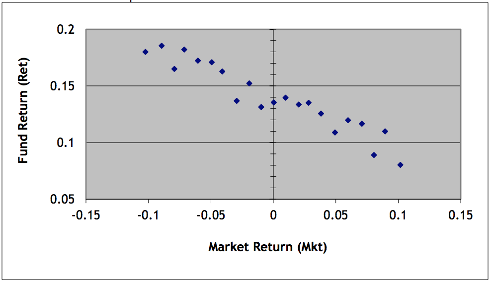
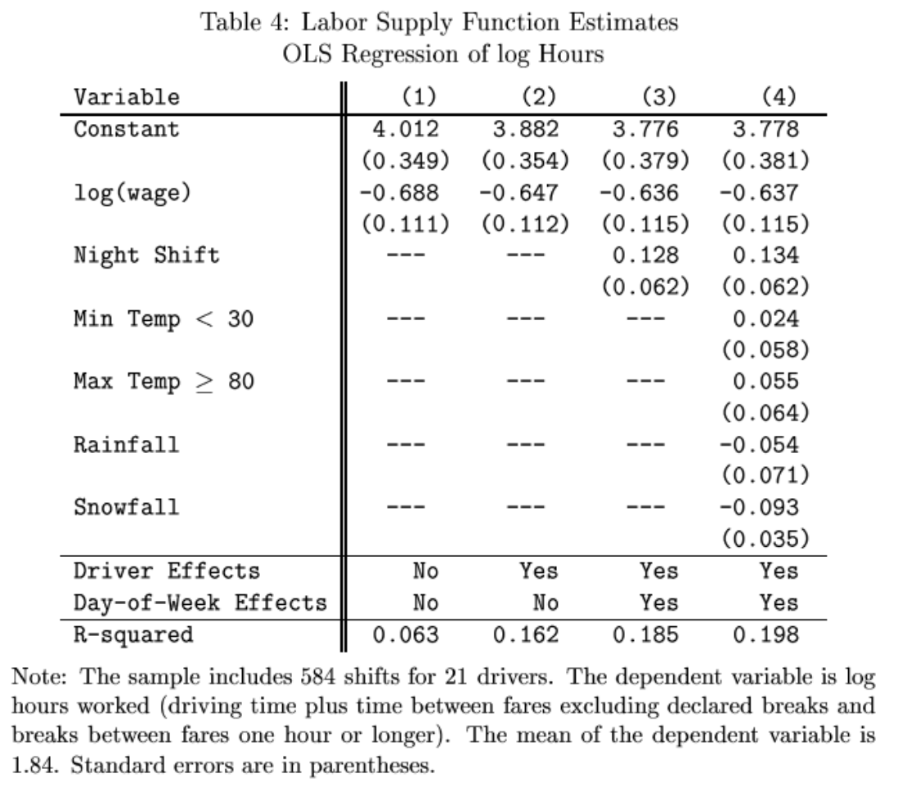

## Using the Normal and Student's T to find p-values
### Please answer the following. You may find it useful to make a sketch
#### Example set 1 (30 points)
a. For a Normal Distribution that has mean 11 and standard deviation 8.2 , what isthe area to the right of 20.84 ?
b. For a Normal Distribution that has mean -5 and standard deviation 4 , what is the area to the left of -6.6 ?
c. For a Normal Distribution that has mean 12 and standard deviation 4.5 , what is the area to the left of 3.45 ?
d. For a Normal Distribution that has mean -14 and standard deviation 7.8 , what is the area to the right of -28.82 ?
e. For a Normal Distribution that has mean 8 and standard deviation 9 , what is the area to the left of -3.7 ?
f. For a Normal Distribution that has mean -10 and standard deviation 6.8 , what is the area in both tails farther from the mean than 4.96 ?
g. For a Normal Distribution that has mean -6 and standard deviation 4.2 , what is the area in both tails farther from the mean than -12.72 ?
h. For a Normal Distribution that has mean 10 and standard deviation 6.4 , what is the area in both tails farther from the mean than -2.8 ?
i. For a Normal Distribution that has mean -6 and standard deviation 3.5 what values leave probability 0.118 in both tails?
j. For a Normal Distribution that has mean -4 and standard deviation 0.1 what values leave probability 0.024 in both tails?
k. A regression coefficient is estimated to be equal to 4.32 with standard error 2.7; there are 12 degrees of freedom. What is the p-value (from the t-statistic) against the null hypothesis of zero?
l. A regression coefficient is estimated to be equal to -19.11 with standard error 9.1; there are 40 degrees of freedom. What is the p-value (from the t-statistic) against the null hypothesis of zero?
m. A regression coefficient is estimated to be equal to -21.16 with standard error 9.2; there are 29 degrees of freedom. What is the p-value (from the t-statistic) against the null hypothesis of zero?

#### Example set 2 (25 points)
a. For a Normal Distribution that has mean -6 and standard deviation 7.1, what is the area to the right of 3.94?
b. For a Normal Distribution that has mean 3 and standard deviation 6.9, what is the area to the right of 18.18?
c. For a Normal Distribution that has mean 12 and standard deviation 9.1, what is the area to the right of 5.63?
d. For a Normal Distribution that has mean 10 and standard deviation 8.7, what is the area to the right of 14.35?
e. For a Normal Distribution that has mean -12 and standard deviation 1.1, what is the area to the left of -13.1?
f. For a Normal Distribution that has mean -2 and standard deviation 6.6, what is the area to the left of -5.96?
g. For a Normal Distribution that has mean 12 and standard deviation 6.3, what is the area in both tails farther from the mean than 8.85?
h. For a Normal Distribution that has mean 4 and standard deviation 7.3, what is the area in both tails farther from the mean than 14.95?
i. For a Normal Distribution that has mean 12 and standard deviation 5.2, what is the area in both tails farther from the mean than 5.76?
j. For a Normal Distribution that has mean 1 and standard deviation 3.1, what is the area in both tails farther from the mean than 7.82?
k. For a Normal Distribution that has mean -8 and standard deviation 1.8 what values leave probability 0.278 in both tails?
l. For a Normal Distribution that has mean 14 and standard deviation 5.9 what values leave probability 0.222 in both tails?
m. A regression coefficient is estimated to be equal to -7.2 with standard error 4.8; there are 10 degrees of freedom. What is the p-value (from the t-statistic) against the null hypothesis of zero?
n. A regression coefficient is estimated to be equal to -5 with standard error 2.5; there are 17 degrees of freedom. What is the pvalue (from the t-statistic) against the null hypothesis of zero?
o. A regression coefficient is estimated to be equal to 5.04 with standard error 2.4; there are 21 degrees of freedom. What is the p-value (from the t-statistic) against the null hypothesis of zero?

#### Example set 3 (15 points)
This set has answers

a. For a Normal Distribution with mean of 12 and standard deviation 0.3, what is area to the right of 12.33?
b. For a Normal Distribution with mean of -2 and standard deviation 7.5, what is area to the right of 4?
c. For a Normal Distribution with mean of -2 and standard deviation 8.6, what is area to the left of -7.16?
d. For a Normal Distribution with mean of -9 and standard deviation 0.8, what is area to the left of -8.04?
e. For a Normal Distribution with mean 3 and standard deviation 8.9, what is area in both tails farther from the mean than -1.45?
f. For a Normal Distribution with mean 6 and standard deviation 6.9, what is area in both tails farther from the mean than -8.49?
g. For a Normal Distribution with mean -4 and standard deviation 5.8, what values leave probability 0.256 in both tails?
h. A regression coefficient is estimated to be equal to -0.6 with standard error 1; there are 23 degrees of freedom. What is the pvalue (from the t-statistic) against the null hypothesis of zero?
i. A regression coefficient is estimated to be equal to 3.04 with standard error 1.9; there are 8 degrees of freedom. What is the pvalue (from the t-statistic) against the null hypothesis of zero?

#### Example set 4
a. For a Normal Distribution with mean 2 and standard deviation 5.6, what is area to the right of 10.4?
b. For a Normal Distribution with mean -1 and standard deviation 4.9, what is area to the right of -7.86?
c. For a Normal Distribution with mean 10 and standard deviation 5.2, what is area to the left of 0.12?
d. For a Normal Distribution with mean 7 and standard deviation 4, what is area to the left of 9.8?
e. For a Normal Distribution with mean 11 and standard deviation 8.4, what is area in both tails farther from the mean than 19.4?
f. For a Normal Distribution with mean -8 and standard deviation 0.4, what is area in both tails farther from the mean than -7.52?
g. For a Normal Distribution with mean 11 and standard deviation 6.3, what is area in both tails farther from the mean than 0.29?
h. For a Normal Distribution with mean 10 and standard deviation 1.5, what is area in both tails farther from the mean than 12.7?
i. For a Normal Distribution with mean -1 and standard deviation 1.2, what is area in both tails farther from the mean than 1.52?
j. For a Normal Distribution with mean 9 and standard deviation 4.9, what values leave probability 0.08 in both tails?
k. For a Normal Distribution with mean 3 and standard deviation 9.6, what values leave probability 0.311 in both tails?
l. A regression coefficient is estimated to be equal to 8.25 with standard error 7.5; there are 35 degrees of freedom. What is the p-value (from the t-statistic) against the null hypothesis of zero?
m. A regression coefficient is estimated to be equal to 10.08 with standard error 5.6; there are 7 degrees of freedom. What is the p-value (from the t-statistic) against the null hypothesis of zero?
n. A regression coefficient is estimated to be equal to -12.04 with standard error 8.6; there are 14 degrees of freedom. What is the p-value (from the t-statistic) against the null hypothesis of zero?

#### Example set 5
a. If a variable has a Normal Distribution with mean 9 and standard deviation 9, what is area to the right of -8.3?
b. For a Normal Distribution with mean 5 and standard deviation 0.4, what is area to the left of 4.7?
c. For a Normal Distribution with mean 6 and standard deviation 0.3, what is area in both tails farther from the mean than 5.7?
d. For a Normal Distribution with mean -2 and standard deviation 3.8, what is area in both tails farther from the mean than 2.9?
e. For a Normal Distribution with mean 6 and standard deviation 7.5, what is area in both tails farther from the mean than -2.3?
f. For a Normal Distribution with mean 14 and standard deviation 3.4, what values leave probability 0.292 in both tails?
g. For a Normal Distribution with mean 8 and standard deviation 2.6, what values leave probability 0.253 in both tails?
h. For a Normal Distribution with mean -11 and standard deviation 2.6, what values leave probability 0.420 in both tails?
i. For a Normal Distribution with mean 2 and standard deviation 4.7, what values leave probability 0.007 in both tails?
j. For a Normal Distribution with mean -10 and standard deviation 7.9, what values leave probability 0.156 in both tails?

#### Example set 6
a. For a Normal Distribution with mean 12 and standard deviation 8.9, what is area to the left of 4.9? A. 0.0888 B. 0.4237 C. 0.2125 D. 0.7881
b. For a Normal Distribution with mean -2 and standard deviation 8.3, what is area to the left of -19.4? A. 0.9945 B. 0.0357 C.0.8531 D. 0.0179
c. For a Normal Distribution with mean 3 and standard deviation 2.6, what is area to the right of 4.3? A. 0.1243 B. 0.3085 C.0.6171 D. 0.6915
d. For a Normal Distribution with mean 1 and standard deviation 2.3, what is area to the right of 0.8? A. 0.1587 B. 0.5346 C.0.3319 D. 0.5199
e. For a Normal Distribution with mean 5 and standard deviation 5.4, what is area in both tails farther from the mean than 10.4? A. 0.1587 B. 0.6346 C. 0.8413 D. 0.3173
f. For a Normal Distribution with mean -7 and standard deviation 2.9, what is area in both tails farther from the mean than -5.3? A. 0.3821 B. 0.1587 C. 0.7257 D. 0.5577
g. For a Normal Distribution with mean 11 and standard deviation 8.2, what is area in both tails farther from the mean than 1.2? A. 0.1587 B. 0.2320 C. 0.8849 D. 0.7257
h. For a Normal Distribution with mean 8 and standard deviation 4.2, what values leave probability 0.046 in both tails? A. (-4.3807, 12.3807) B. (-0.0906, 3.9002) C. (-0.3807, 16.3807) D. (2.4201, 13.5799)
i. For a Normal Distribution with mean -6 and standard deviation 6.7, what values leave probability 0.347 in both tails? A. (-9.1504, -2.8496) B. (-1.8359, 0.0449) C. (-8.6360, -3.3640) D. (-12.3008, 0.3008)
j. For a Normal Distribution with mean 5 and standard deviation 0.1, what values leave probability 0.301 in both tails? A. (4.9478, 5.0522) B. (4.8966, 5.1034) C. (4.9657, 5.0343) D. (-1.0343, 1.0343)

#### Example set 7
a. For a Standard Normal Distribution, what is area to the left of 2.1? A. 0.5328 B. 0.0357 C. 0.3507 D. 0.9821
b. For a Standard Normal Distribution, what is area to the left of -0.6? A. 0.2743 B. 0.0547 C. 0.1368 D. 0.2002
c. For a Standard Normal Distribution, what is area to the left of 0.3? A. 0.3821 B. 0.9390 C. 0.6179 D. 0.7642
d. For a Standard Normal Distribution, what is area to the right of 0.9? A. 0.1841 B. 0.0875 C. 0.3684 D. 0.0552
e. For a Standard Normal Distribution, what is area to the right of -0.4? A. 0.5870 B. 0.3446 C. 0.6225 D. 0.6554
f. For a Standard Normal Distribution, what is area in both tails farther from the mean than 1.8? A. 0.9641 B. 0.1841 C. 0.1437 D. 0.0719
g. For a Standard Normal Distribution, what is area in both tails farther from the mean than 0.5? A. 0.0760 B. 0.5987 C. 0.6915 D. 0.6171
h. For a Standard Normal Distribution, what is area in both tails farther from the mean than -2.4? A. 0.9918 B. 0.0328 C. 0.0164 D. 0.0470
i. For a Standard Normal Distribution, what values leave probability 0.324 in both tails? A. ??0.4565 B. ??1.2305 C. ??0.9863 D. ??0.3799
j. For a Standard Normal Distribution, what values leave probability 0.390 in both tails? A. ??0.8596 B. ??0.8596 C. ??1.1948 D. ??0.4298
k. For a Standard Normal Distribution, what values leave probability 0.218 in both tails? A. ??0.7790 B. ??0.1611 C. ??1.2319 D. ??1.2957

#### Example set 8
a. For a Standard Normal Distribution, what is the area closer to the mean than 1.45?
b. For a Standard Normal Distribution, what is the area to the right of 2?
c. For a Normal Distribution with mean 5 and standard deviation 7.6, what is area to the right of 14.1?
d. For a Normal Distribution with mean 1 and standard deviation 7.8, what is area in both tails farther from the mean than 11?
e. For a Normal Distribution with mean -5 and standard deviation 1.6, what is area in both tails farther from the mean than -2.6?
f. For a Normal Distribution with mean -1 and standard deviation 9.8, what values leave probability 0.157 in both tails?

#### Example set 9
a. What is the probability, if the true distribution is a Standard Normal, of seeing a deviation from zero as large (in absolute value) as 1.9?
b. What is the probability, if the true distribution is a Standard Normal, of seeing a deviation from zero as large (in absolute value) as -1.5?
c. What is the probability, if the true distribution is a Standard Normal, of seeing a deviation as large (in absolute value) as 1.2?

#### Example set 10
a. What is the probability, if the true distribution has mean -1 and standard deviation of 1.5, of seeing a deviation as large (in absolute value) as 2?
b. What is the probability, if the true distribution has mean 50 and standard deviation of 30, of seeing a deviation as large (in absolute value) as 95?
c. What is the probability, if the true distribution has mean 0.5 and standard deviation of 0.3, of seeing a deviation as large (in absolute value) as zero?

#### Example set 11
a. What is the probability, if the true distribution is a Standard Normal, if seeing a value as large as 1.75?
b. What is the probability, if the true distribution is a Standard Normal, if seeing a value as large as 2?
c. If you observe a value of 1.3, what is the probability of observing such an extreme value, if the true distribution were Standard Normal ?
d. If you observe a value of 2.1, what is the probability of observing such an extreme value, if the true distribution were Standard Normal ?
e. What are the bounds within which 80% of the probability mass of the Standard Normal lies?
f. What are the bounds within which 90% of the probability mass of the Standard Normal lies?
g. What are the bounds within which 95% of the probability mass of the Standard Normal lies?

#### Example set 12
a. Find the area under the standard normal pdf between -1.75 and 0.
b. Find the area under the standard normal pdf between 0 and 1.75.
c. What is the probability of finding a value as large (in absolute value) as 1.75 or larger, if it truly has a standard normal distribution?
d. What values form a symmetric 90% confidence interval for the standard normal (where symmetric means that the two tails have equal probability)? A 95% confidence interval?

#### Example set 13
Consider a normal pdf with mean of 3 and standard deviation of 4.

a. Find the area under the normal pdf between 3 and 7.
b. Find the area under the normal pdf between 7 and 11.
c. What is the probability of finding a value as far away from the mean as 7 if it truly has a normal distribution?

#### Example set 14
a. If a random variable is distributed normally with mean 2 and standard deviation of 3, what is the probability of finding a value as far from the mean as 6.5?
b. If a random variable is distributed normally with mean -2 and standard deviation of 4, what is the probability of finding a value as far from the mean as 0?
c. If a random variable is distributed normally with mean 2 and standard deviation of 3, what values form a symmetric 90% confidence interval?
d. If a random variable is distributed normally with mean 2 and standard deviation of 2, what is a symmetric 95% confidence interval? What is a symmetric 99% confidence interval?

#### Example set 15
a. What is the probability that we could observe a value as far or farther than 1.7?
b. What is the probability that we could observe a value nearer than 0.7?
c. What is the probability that we could observe a value as far or farther than 1.6?
d. What is the probability that we could observe a value nearer than 1.2?
e. What value would leave 15% of the probability in the left tail?
f. What value would leave 10% of the probability in the left tail?

#### Example set 16
A random variable is distributed with mean of 8 and standard deviation of 4.

a. What is the probability that we could observe a value lower than 6?
b. What is the probability that we could observe a value higher than 12?
c. What is the probability that we'd observe a value between 6.5 and 7.5?
d. What is the probability that we'd observe a value between 5.5 and 6.5?
e. What is the probability that the standardized value lies between 0.5 and -0.5?

#### Example set 17
a. What is the probability, if the true distribution is a Standard Normal, of seeing a deviation from zero as large (in absolute value) as 1.9?
b. What is the probability, if the true distribution is a Standard Normal, of seeing a deviation from zero as large (in absolute value) as -1.5?
c. What is the probability, if the true distribution is a Standard Normal, of seeing a deviation as large (in abs0lute value) as 1.2?*

d. What is the probability, if the true distribution has mean -1 and standard deviation of 1.5, of seeing a deviation as large (in absolute value) as 2?
e. What is the probability, if the true distribution has mean 50 and standard deviation of 30, of seeing a deviation as large (in absolute value) as 95?
f. What is the probability, if the true distribution has mean 0.5 and standard deviation of 0.3, of seeing a deviation as large (in absolute value) as zero?


\newpage

## Statistics from given numbers (no datasets in R required)

#### 1. Confidence Intervals, Hypothesis Tests
Consider an election with generic candidates X vs Y (which we could interpret as chromosomes but not necessarily!).

a. Candidate X had the support of 54% of the voters in the latest poll, which had 200 people. What is a 90% confidence interval for the actual level of support?
b. If the polling organization were to add 100 more people to the sample size, how much would the 90% confidence interval change?
c. Last month's poll had the candidate supported by 51% -- both the previous poll and the current poll had 200 people. Is the difference in polling statistically significant?
d. Candidate X must win 2 particular states in order to win the election; the forecast says she has a 60% chance of winning each state individually. Your friend, a wannabe statistician, explains that a 0.6 chance of winning one state and a 0.6 chance of winning the other means only a 0.6*0.6= 0.36 chance of winning both - so the "favorite" is actually not the favorite! Explain why your friend is wrong.

#### 2. Confidence Intervals, Minimum n (20 points) 
Suppose that a particular medical treatment already improves patient outcomes by 20 (don't worry about the units for now) and it is established that the standard deviation for the population is 8. There is an improved treatment that is expected to deliver a further 10% improvement.

a. If there were 10 patients in the trial, what would be the t-statistic, p-value, and confidence interval - assuming the new treatment works as expected? Carefully explain the null hypothesis.
b. If there were 30 patients, what would be the t-stat, p-value, and confidence interval (again assuming the treatment works as expected)?
c. If the company wants a p-value of 5% or lower, how many patients should they plan to have in the trial?

#### 3. Hypothesis Tests, Conditionals (20 points)
Consider the following table of numbers of people (from CPS data) who make under or over $15/hr in wage - a level that
some politicians want to set as the new minimum wage. (This is a particular subset, don't bother trying to replicate, the numbers given
here should be sufficient.)

|               | |   Wage less than \$15/hr | |  Wage greater than \$15/hr | | 
| ------------- |-------------------------|----------------------------|---|----|
| | Native  | Immigrant  | Native | Immigrant |
| Educ HS or more | 14235 | 3113 | 33150 | 5296 |
| no HS diploma  | 1062 | 1824 | 662 | 567 |

a. Is the fraction of immigrants making less than $15/hr different from the fraction making more than $15/hr? In a statistical test
of the difference, what is t-statistic, p-value, and confidence interval?
b. Is the fraction of people without a HS diploma, making less than $15/hr, different from the fraction making more than $15/hr?
In a statistical test of the difference, what is t-statistic, p-value, and confidence interval?
c. In the population of people making less than $15/hr, what fraction are immigrants without a HS diploma?
d. What is the conditional probability of finding an immigrant without a HS degree, given that the person is an immigrant and is
making less than $15/hr?
e. What is the conditional probability of finding an immigrant without a HS degree, given that the person is an immigrant and is
making more than $15/hr?

#### 4. Confidence Intervals, Hypothesis Tests (20 points)
We consider the co-movement of unemployment and industrial production, comparing the change in the unemployment rate (UR) for months when industrial production (IP) rose against the change in the unemployment rate when industrial production fell, for months since 1975. (Note that UR is measured in percentage points, so a change of .01 means UR went from 5% to 5.01%.)

|                     | mean change in UR  | std. dev. of UR change  | N    |
|---------------------|--------------------|-------------------------|------|
| months when IP rose | -.0498             | .1513                   | 325
| months when IP fell | .0815              | .1836                   | 162

a. What is a t-statistic, p-value, and confidence interval for the null hypothesis that there is no difference?
b. Consider the same stats, but now looking only at the time since 2000,

|                     | mean change in UR  | std. dev. of UR change  | N    |
|---------------------|--------------------|-------------------------|------|
| months when IP rose |  -.0349            | .1431                   | 112
| months when IP fell | .0667              | .1840                   | 75

c. With the R-code below, can you find other relationships? Do these differences from above seem reasonable?

```{r eval=FALSE}
library(quantmod)
getSymbols(c('INDPRO','UNRATE'),src='FRED')
ip_1 <- INDPRO["1965::"]
ur_1 <- UNRATE["1965::"]
d_ip <- na.trim(ip_1 - lag(ip_1))
d_ur <- na.trim(ur_1 - lag(ur_1))
```


#### 5. Know your data (10 points)
One of the first notes in class emphasized "know your data." You've done a few homework assignments using Consumer
Expenditure Survey data, tell me about that data. How do they calculate expenditure on food away from home?


#### 6. Correlations, Hypothesis Tests (20 points)
A recent research paper, looking at how much attractiveness and personal grooming affects wages, used data from The
National Longitudinal Study of Adolescent Health in 2001-2.

a. Are there gender differences? Among the 6074 people (48.4% female), 38.8% of the males were rated as being well groomed
or very well groomed; 50.6% of the females were rated that way. Is this a statistically significant difference?
b. The study considers interrelations between physical attractiveness and grooming. People were ranked on a 4-point scale
(where 1 is below average, 2 is average, 3 is above average, and 4 is very much above average) for each attribute. The full
details are:

##### Physically

|                               | 4 Very Attractive | 3 Attractive | 2 Average | 1 Less Attractive |
|-------------------------------|-------------------|--------------|-----------|-------------------|
| 4 Very well groomed           | 297               | 199          | 57        | 30
| 3 Well groomed                | 290               | 1169         | 607       | 54
| 2 Average grooming            | 75                | 788          | 2013      | 167
| 1 Less than average grooming  | 1                 | 25           | 164       | 138

c. Conditional on a person being ranked physically 3 or 4 in attractiveness (above average), what is the chance that they are above average (3 or 4) in grooming as well. Conditional on being above average physically, what is the chance that they are average or below average (1 or 2) in grooming? Are these statistically significantly different?
The study also considers the attractiveness of someone's personality (charisma), with the same 4-point scale. These data are:

##### Personality

|                               | 4 Very Attractive | 3 Attractive | 2 Average | 1 Less Attractive |
|-------------------------------|-------------------|--------------|-----------|-------------------|
| 4 Very well groomed           | 326               | 171          | 60        | 26
| 3 Well groomed                | 416               | 1186         | 467       | 51
| 2 Average grooming            | 212               | 966          | 1729      | 136
| 1 Less than average grooming  | 11                | 49           | 184       | 84
         
d. Conditional on having an above-average personality, what is the chance that someone has above-average grooming? Conditional on having an above-average personality, what is the chance that their grooming is at or below average? Is there a statistically significant difference?
e. Comment on the study. If overall attractiveness is a combination of these 3 factors, is there evidence that they are gross substitutes or complements in production?

*PK Robins, JF Homer, MT French (2011). "Beauty and the Labor Market: Accounting for the Additional Effects of Personality and
Grooming,"" Labour, 25(2), pp 228-251.*


#### 7. Confidence Intervals. (30 points)
You know that a random variable has a normal distribution with standard deviation of 16. After 10 draws, the average is -12.

a. What is the standard error of the average estimate?
b. If the true mean were -11, what is the probability that we could observe a value between -10.5 and -11.5?

You know that a random variable has a normal distribution with standard deviation of 25. After 10 draws, the average is -10.
a. What is the standard error of the average estimate?
b. If the true mean were -10, what is the probability that we could observe a value between -10.5 and -9.5


#### 8. Confidence intervals, Hypothesis tests (15 points)

I tracked down this reference from a sign on the bus, from Tobacco Free NY. A survey of 1681 adolescents (age 11-14) in California asked if they had tried smoking and how often they went to convenience, liquor, or small grocery stores. The study finds that 452 kids rarely went to these stores and 81 had tried cigarettes; 458 kids visited these stores often (more than twice a week) and 133 had tried cigarettes. The authors assert that visiting these stores exposed the kids to more tobacco advertising.

a. What is the difference in means?
b. What is the standard error of the difference in means?
c. Is this difference statistically significant? What is the p-value? Explain.
d. The kids were also asked if their grades were likely to be at the level of B or below; 52 of the rare-frequency kids had belowaverage grades, while 63 of the high-frequency visitors had below-average grades. Is this difference statistically significant?
e. When asked about how often they had seen tobacco advertising, low-frequency visitors reported a mean of 3.1 (with standard error of 0.8) on a scale of 1-4 where 4 means "often"; high-frequency visitors reported a mean of 3.4 (with standard error of 0.8). Is this difference statistically significant?
f. Discuss the study; what else might you add?

 *Hendrick, L, N C Schleicher, E C Feighery, and S P Fortmann, (2010). "Longitudinal Study of Exposure to Retail Cigarette Advertising and
Smoking Initiation," Pediatrics.*


#### 9. Confidence Intervals, Hypothesis test (15 points) 
You might have missed this in the news about Alice Munro winning the Nobel, but there was a study done, showing that reading literature such as Munro and Chekov tended to make people score higher on psychological tests of Affective Theory of Mind. Consider the difference between two groups of people: either they read from a selection of literary fiction or they read non-fiction articles about non-human subjects (e.g. potatoes). They were all given a test to determine how well they could identify emotion from a picture of a person's eyes. (I'm making up some of these numbers.) The Fiction group tests at 25.6 with standard deviation of 4.38; the Non-fiction group tests at 23.5 with standard deviation of 5.17. There were 41 people in the first group and 45 in the second group.

a. What is the difference in means?
b. What is the standard error of the difference in means?
c. Is this difference statistically significant? What is the p-value? Explain.
d. In another test, people read either literary fiction (that had won awards) or pop fiction (ie good sales but no awards). The lit fiction group scored 26.1 with standard deviation of 5.43 while the pop fiction group scored 23.7 with standard deviation of 5.08. Is this difference statistically significant?
e. Discuss the study, both in strengths and limitations.

*Kidd, D C, and E Castano, (2013). "Reading Literary Fiction Improves Theory of Mind," Science.*


#### 10. OLS, Confidence Intervals, OLS (20 points)
You are comparing two groups: the first has X=0 and Y=1 and Y=3; the second has X=10 and Y=9 and Y=7. [So there are four data points: (0,1), (0,3), (10,9), (10,7).]

a. What is the difference in means between the groups?
b. What is the standard error for the difference in means?
c. Is the difference in means statistically significant?
d. What is the slope of a regression line fitted to the four points?
e. What is the standard error of the slope?
f. Is the slope statistically significant?
g. If the Y-observations in the second group were bigger, they might test as significant for the difference in means. If the second group were (10,9+A) and (10,7+A), what value(s) of A would make the difference significant?
h. Now if the values of Y were changed to (10,9+B) and (10,7+B), what value(s) of B would make the slope significant?
i. What if, instead, the X-values were changed by (10+C,9) and (10+C,7) - what value(s) of C would make the slope significant?
j. Would changing X values change the estimate for the difference in means? Explain.


#### 11. Hypothesis test, standard error (15 points)
A (joking) study in the New England Journal of Medicine linked a country's per capita consumption of chocolate with the number of Nobel Prizes. It reported a regression coefficient but I got the data and did my own analysis. Five countries with the highest consumption of chocolate (UK, Belgium, Germany, Norway, Switzerland) had 19.02 Nobel Prizes per 10m people (std dev 9.0); the next five countries (USA, Finland, Denmark, Austria, Ireland) with lower chocolate consumption had 16.13 prizes (std dev 8.1).

a. Construct a hypothesis test for whether there is no statistically significant difference between the most chocolate-consuming countries and the next group. What is the standard error of the difference? What is the test statistic? What is the p-value?

b. Discuss the study. The countries that ate the most chocolate consumed 9.28 kg/person (std dev 0.54) while the next group ate merely 7.34 kg/person (std dev 1.52). Should you have eaten a chocolate bar before this exam?
*F H Messerli (2012). "Chocolate Consumption, Cognitive Function, and Nobel Laureates" N Engl J Med 367: 1562-1564 October 18, 2012*

#### 12. Hypothesis test (15 points)
A (not joking) report from Morgan Stanley reported that the bank's positions were 23% safer because the bank chose to measure risk with the standard deviation of stock returns from the past one year rather than more years as it had done previously. Over the past one year, the average daily returns on the S&P500 (expressed at monthly rate) were 1.7% with a standard deviation of 3.6% (252 observations). For the four years before, the average return was -0.6% with a standard deviation of 6.5% (1008 observations). Test the null hypothesis that the returns for the past year are the same as the returns for the previous four years. What is the standard error of the difference? What is the test statistic? What is the p-value? Discuss. Why might Morgan Stanley have chosen that particular data? (Note that riskiness is a cost so reduces profits.) *The Excel file with this data is on Blackboard although you do not need to use it.*

#### 13. Hypothesis test (15 points)
A survey from eFinancialCareers found that, despite predictions from NY State that the Wall St bonus pool would drop by about 35%, a full 48% of the 911 respondents believed that their own bonuses would rise.

a. Test the null hypothesis that the fraction of respondents expecting a bigger bonus is different from 35%. What is the p-value?
b. Create a 95% confidence interval for the fraction expecting a bigger bonus. What is the 90% confidence interval? The 99%
interval?
c. Discuss. What other survey question might help explain this difference?

#### 14. Hypothesis test (15 points)
Dan Ariely and co-authors report a study that asks participants to solve complicated addition tasks but gives them an opportunity to cheat: they self-report how many problems they correctly solve. Every participant got a pair of fashion sunglasses but some were told that the sunglasses were counterfeit. Forty-two people were told they got counterfeit sunglasses and 30 of them cheated; 43 people were told that they got authentic sunglasses and 13 of them cheated.

a. Test the null hypothesis that there is no difference in the rates of cheating for people wearing counterfeit or authentic sunglasses. What is the p-value?
b. Create a 95% confidence interval for the difference in cheating rates. What is the 90% confidence interval? The 99% interval?
c. Discuss. Are there other factors that could be at work?

*F Gino, M I Norton, D Ariely (2010). "The Counterfeit Self: the Deceptive Costs of Faking It," Psychological Science 21:712.*

#### 15. Minimum smaple size, (15 points)
An audit study emailed professors to ask for an appointment but the names of the 'students' were randomly varied to be typically male or female; white, African-American, Hispanic, Chinese, or Indian. White men were 26% more likely to get an appointment than minority women. Suppose you wanted to do a replication study for CUNY faculty. The original study emailed 6500 professors, you would like to study fewer.

a. If the true difference in response to white male vs other names is 26%, what is the minimum sample size that could distinguish a statistically significant difference (at 95% level)?
b. If the true difference were half as large, what is the minimum sample size to distinguish a difference?
c. What if the true difference were just 6%? What is the minimum sample size necessary?
d. Discuss. Can you suggest additional tests?

*K L Mikman, M Akinola, D Chugh, 2012. "Temporal Distance and Discrimination: An Audit Study in Academia," Psychological Science 23:7.*


#### 16. Hypothesis test, Confidence interval (15 points)
In recent news a study of adolescent girls compared those who had received a vaccination against HPV (a sexually transmitted virus that is linked to certain cancers) with those who had not received the vaccine. Some parents had been reluctant to get their children vaccinated because they believed this would encourage sexual activity. The study compared 493 who got the vaccine agains 905 who did not. Of the girls who got the vaccine, 61 got any of testing, diagnosis or counseling for pregnancy/sexuallytransmitted disease; of those who did not get the vaccine, 76 got testing, diagnosis, or counseling.

a. Test the null hypothesis that there is no difference between outcomes for those who got the vaccine versus those who did not.
What is the p-value for this difference? 
b. Create a 95% confidence interval for the difference between the groups. What is the 90% confidence interval? The 99%
interval?
c. Discuss why this difference might be observed and how someone might critique the study.

*R A Bednarczyk, R Davis, K Ault, W Orenstein, S B Omer (2012). "Sexual Activity-Related Outcomes After Human Papillomavirus Vaccination of
11- to 12-Year-Olds," Pediatrics.*

#### 17. Hypothesis tests (15 points)
In a medical study (reference below), people were randomly assigned to use either antibacterial products or regular soap. In
total 592 people used antibacterial soap; 586 used regular soap. It was found that 33.1% of people using antibacterial products got a
cold; 32.3% of people using regular soap got colds.

a. Test the null hypothesis that there is no difference in the rates of sickness for people using regular or antibacterial soap. (What
is the p-value?)
b. Create a 95% confidence interval for the difference in sickness rates. What is the 90% confidence interval? The 99% interval?
c. Every other study has found similar results. Why do you think people would pay more for antibacterial soaps?

*E.L.Larson, S.X. Lin, C. Gomez-Pichardo, P. Della-Latta, (2004). "Effect of Antibacterial Home Cleaning and Handwashing Products on Infectious
Disease Symptoms: A Randomized Double-Blind Trial," Ann Intern Med, 140(5), 321-329.*


#### 18. Hypotheses tests (15 points)
A study of workers and managers asked both how much management listened to workers' suggestions (on a scale of 1-7 where "1" indicates that they paid great attention). Managers averaged a 2.50 (standard deviation of 0.55); workers answered an average 2.08 (standard deviation of 0.76) - managers ignore their workers even more often than the employees realize. There were 137workers and 14 managers answering.

a. Test the null hypothesis that there was no difference between workers and managers: how likely is it that there is actually no difference in average response? (What is the p-value?)
b. Create a 95% confidence interval for the difference between workers and managers. What is the 90% confidence interval? The 99% interval?

#### 19. Hypothesis tests, Confidence Interval (15 points) 
A recent survey by Intel showed that 53% of parents (561 were surveyed) were uncomfortable talking with their children
about math & science. Previous surveys found that 57% of parents talked with their kids about sex & drugs.

a. Test the null hypothesis that parents are as comfortable talking about math & science as sex & drugs; that the true value of parents uncomfortable with math and science is not different from 57%. What is the p-value?
b. Create a 95% confidence interval for the true fraction of parents who are uncomfortable with math & science. What is the 90%confidence interval? The 99% interval?

#### 20. Hypothesis tests. (15 points) 
The New York Times reported on educational companies that over-sell their products and gave the example of "Cognitive Tutor" (CT) that helps math students. The CT students improved by 17.41 (standard deviation of 5.82); the regular students improved by 15.28 (standard deviation of 5.33). There were 153 students in the new program and 102 regular students.

a. Test the null hypothesis that there is no difference between regular students and those in the CT group. What is the p-value
for this difference? 
b. Create a 95% confidence interval for the difference between regular and CT students. What is the 90% confidence interval?
The 99% interval?


#### 21. Confidence Interval, Analysis
You are in charge of polling for a political campaign. You have commissioned a poll of 300 likely voters. Since voters are divided into three distinct geographical groups, the poll is subdivided into three groups with 100 people each. The poll results are as follows: 

|                              | total  | A       | B       | C
|------------------------------|--------|---------|---------|-------|
| number in favor of candidate | 170    | 58      | 57      | 55
| number total                 | 300    | 100     | 100     | 100
| std. dev. of poll            | 0.4956 | 0.4936  | 0.4951  | 0.4975
Note that the standard deviation of the sample (not the standard error of the average) is given.

a. Calculate a t-statistic, p-value, and a confidence interval for the main poll (with all of the people) and for each of the subgroups.
b. In simple language (less than 150 words), explain what the poll means and how much confidence the campaign can put in the
numbers.
c. Again in simple language (less than 150 words), answer the opposing candidate's complaint, "The biased media confidently
says that I'll lose even though they admit that they can't be sure about any of the subgroups! That's neither fair nor accurate!"

#### 22. Hypothesis tests
Using data from the NHIS, we find the fraction of children who are female, who are Hispanic, and who are African-American, for two
separate groups: those with and those without health insurance. Compute tests of whether the differences in the means are significant;
explain what the tests tell us. (Note that the numbers in parentheses are the standard deviations.)

|                 | with health insurance  | without health insurance |
|-----------------|------------------------|--------------------------|
| female          |  0.4905                | 0.4811
|                 | (0.49994) N=7865       | (0.49990) N=950
| Hispanic | 0.2587  | 0.5411
| | (0.43797) N=7865 | (0.49857) N=950
| African American   | 0.1785  | 0.1516
| | (0.38297) N=7865 |  (0.35880) N=950


#### 23. Hypothesis tests (difference in proportions)
 A paper by Chiappori, Levitt, and Groseclose (2002) looked at the strategies of penalty kickers and goalies in soccer. Because of the speed of the play, the kicker and goalie must make their decisions simultaneously (a Nash equilibrium in mixed strategies). For example, if the goalie moves to the left when the kick also goes to the left, the kick scores 63.2% of the time; if the goalie goes left while the kick goes right, then the kick scores 89.5% of the time. In the sample there were 117 occurrences when both players went to the left and 95 when the goalie went left while the kick went right. What is the p-value for a test that the probability of scoring is different? What advice, if any, would you give to kickers, based on these results? Why or why not?

#### 24. Hypothesis tests (difference in proportions)
A paper by Claudia Goldin and Cecelia Rouse (1997) discusses the fraction of men and women who are hired by major orchestras after auditions. Some orchestras had applicants perform from behind a screen (so that the gender of the applicant was unknown) while other orchestras did not use a screen and so were able to see the gender of the applicant. Their data show that, of 445 women who auditioned from behind a screen, a fraction 0.027 were "hired". Of the 599 women who auditioned without a screen, 0.017 were hired. Assume that these are Bernoulli random variables. Is there a statistically significant difference between the two samples? What is the p-value? Explain the possible significance of this study.

#### 25. Hypothesis tests (difference in proportions) 
Another paper, by Kristin Butcher and Anne Piehl (1998), compared the rates of institutionalization (in jail, prison, or mental hospitals) among immigrants and natives. In 1990, 7.54% of the institutionalized population (or 20,933 in the sample) were immigrants. The standard error of the fraction of institutionalized immigrants is 0.18. What is a 95% confidence interval for the fraction of the entire population who are immigrants? If you know that 10.63% of the general population at the time are immigrants, what conclusions can be made? Explain. 

#### 26. Standard error, minimum sample size
You are consulting for a polling organization. They want to know how many people they need to sample, when predicting the results of
the gubernatorial election.

a. If there were 100 people polled, and the candidates each had 50% of the vote, what is the standard error of the poll?
b. If there were 200 people polled?
c. If there were 400 people polled?
d. If one candidate were ahead with 60% of the vote, what is the standard error of the poll?
e. They want the poll to be 95% accurate within plus or minus 3 percentage points. How many people do they need to sample?


#### 27. Hypothesis test (20 points)
A recent report asserted that people who worked more hours also tended to be fatter (among those in certain occupations).
(The paper doesn't give precise numbers so I'll make them up - don't bother with Google.) The paper did much more econometric
analysis of course. Nevertheless, suppose that, of the 7219 women working non-strenuous occupations, 23% are working more than 40
hours/week. Of those women in non-strenuous occupations working more than 40 hours/week, 27.3% were obese; of those women in
non-strenuous occupations working less than 40 hours/week, 24.6% were obese. There were also 714 women in strenuous occupations
with 21% working more than 40 hours/week. Of the women in strenuous occupations working more than 40 hours/week, 28.1% were
obese while 37.4% were obese among those working fewer hours. Does it seem likely that overtime makes certain groups more likely to
be obese? 
*J Abramowitz, "Working Hours, Body Mass Index, and Health Status: A Time Use Analysis"*


\newpage
## Regression Analysis from given data (no datasets in R required)

#### 1. Fill in p-values
To investigate an hypothesis proposed by a student, I got data, for 102 of the world's major countries, on the fraction of the population
who are religious as well as the income per capita and the enrollment rate of boys and girls in primary school. The hypothesis to be
investigated is whether more religious societies tend to hold back women. I ran two separate models: Model 1 uses girls enrollment rate
as the dependent; Model 2 uses the ratio of girls to boys enrollment rates as the dependent. The results are below (standard errors in
italics and parentheses below each coefficient):

| | Model 1  | Model 2  | t-stat | p-value |
|---|---|---|---|---|
| Intercept | 137 | 1.12 | ___ |  ___ |
|  | (18)  | (0.09) |  |   |
| Religiosity | -0.585 | -0.0018 | ___ |  ___ |
|  | (0.189) |  (0.0009) |  |   |
| GDP per capita | 0.00056 | 0.0000016 | ___ |  ___ |
| | (0.00015) | (0.0000007) |  |   |

a. Which coefficient estimates are statistically significant? What are the t-statistics and p-values for each?
b. How would you interpret these results?
c. Critique the regression model. How would you improve it?

#### 2. Fill in p values (20 points)
Peter Gordon, in his talk at CCNY, presented results from linear regressions to explain the growth of metropolitan areas. He begins with
a simple model to explain population growth from 1990-2000:

###### Log Population Growth 1990-2000

|                      | Coefficient |  t-stat |  p-value |
|----------------------|-------------|---------|----------|
| Constant term        | -0.0229     | -0.12   |      |  
| Population in 1990 (log) | 0.0192 | 1.33 | ___ |
| Pop. Density in 1990 | -0.0504 | -1.65 | ___
| % in manufacturing  | -0.0028 | -1.63 | ___
| R2 0.57

Where he also includes dummy variables for Census Regions (New England, Mid Atlantic, etc.). There are 79 observations and 67
degrees of freedom.

a. What are the p-values for the 3 coefficients? Are they significant?

The averages and standard deviations are:

| | Average | Standard deviation |
|---|---|---|
| Population in 1990 (log) | 14.52 | 14.89
| Pop. Density in 1990     |  1.80 | 1.02
| % in manufacturing       | 18.69 | 7.75

b. What is the predicted population growth for a metropolitan area that is exactly average?
c. What is the predicted population growth for a metro area that is one standard deviation above average in 1990 population?
For a metro area one standard deviation above average in density? In manufacturing concentration?
d. Give a careful explanation for why we would observe coefficients of these signs. 

#### 3. Finish the regression table
Fill in the blanks in the following table showing SPSS regression output. The model has the dependent variable as time spent working at
main job.
Coefficients(a)
Model
Unstandardized
Coefficients

|              | B     |  Std. Error  | t     | Sig. |
|-|-|-|-|-|
| 1 (Constant) | 198.987 |  7.556 |  26.336 | .000 |
Female           | -65.559 | 4.031  | _____ | _____ |
African-American | -9.190  | 6.190  | _____ | _____ |
Hispanic         | 17.283  | 6.387  | _____ | _____ |
Asian            | 1.157   | 12.137 | _____ | _____ |
Native American/Alaskan Native  | -28.354 | 14.018  | -2.023 | .043 |
Education: High School Diploma  | _____ | 6.296    | 11.706 | .000 |
Education: Some College         | _____ | 6.308    | 14.651 | .000 |
Education: 4-year College Degree| 110.064 | _____  | 16.015 |  .000 |
Education: Advanced degree      | 126.543 | _____  | 15.714 |  .000 |
Age                             |  -1.907 | _____  | -16.428 |  .000 |
a Dependent Variable: Time Working at main job

#### 4. Critique the regression. Standardized vs Non-standardized coefficients
You want to examine the impact of higher crude oil prices on American driving habits during the past oil price spike. A regression of US
gasoline purchases on the price of crude oil as well as oil futures gives the coefficients below. Critique the regression and explain
whether the necessary basic assumptions hold. Interpret each coefficient; explain its meaning and significance.
Coefficients(a)
Model
Unstandardized
Coefficients
Standardized
Coefficients

| Model | B | Std. Error  | Beta  | t  | Sig. |
|---|---|---|---|---|---|
| 1 (Constant) | .252 | .167 |  | 1.507 | .134 |
| return on crude futures, 1 month ahead | .961 | .099 | .961 | 9.706 | .000 |
| return on crude futures, 2 months ahead  | -.172 | .369 | -.159 |  -.466 | .642 |
| return on crude futures, 3 months ahead  | .578  | .668 | .509  | .864 | .389 |
| return on crude futures, 4 months ahead  | -.397 | .403 | -.333 |  -.986 | .326 |
| US gasoline consumption                  | -.178 | .117 | -.036 |  -1.515 | .132 |
| Spot Price Crude Oil Cushing, OK WTI FOB*  | 4.23E-005 | .000 | .042 | 1.771 | .079 |
a Dependent Variable: return on crude spot price

\* Dollars per barrel

#### 5. Kevin Needs Money, estimate the intercept, slope
Suppose I were to start a hedge fund, called KevinNeedsMoney Limited Ventures, and I want to present evidence about how my fund
did in the past. I have data on my fund's returns, Rett, at each time period t, and the returns on the market, Mktt. The graph below
shows the relationship of these two variables:



a. I run a univariate OLS regression, $Ret_t = \beta_0 + \beta_1 Mkt_t + u_t$. Approximately what value would be estimated for the intercept term, $\beta_0$? For the slope term, $\beta_1$?
b. How would you describe this fund's performance, in non-technical language - for instance if you were advising a retail investor
without much finance background?


#### 6. ATUS statistical significance
Using the American Time Use Study (ATUS) we measure the amount of time that each person reported that they slept. We run a
regression to attempt to determine the important factors, particularly to understand whether richer people sleep more (is sleep a
normal or inferior good) and how sleep is affected by labor force participation. The SPSS output is below.

Coefficients(a)

| | B | Std. Error | t | Sig. |
|---------------------------------|-----------|-----------|---------|---------|
| 1 (Constant)                    |  -4.0717  |  4.6121   |  -0.883 |   0.377
| female                          |  23.6886  |  1.1551   |  20.508 |   0.000
| African-American                |  -8.5701  |  1.7136   |  -5.001 |   0.000
| Hispanic                        |  10.1015  |  1.7763   |   5.687 |   0.000
| Asian                           |  -1.9768  |  3.3509   |  -0.590 |   0.555
| Native American/Alaskan Native  |  -3.5777  |  3.8695   |  -0.925 |   0.355
| Education: High School Diploma  |   2.5587  |  1.8529   |   1.381 |   0.167
| Education: Some College         |  -0.3234  |  1.8760   |  -0.172 |   0.863
| Education: 4-year College Degree|  -1.3564  |  2.0997   |  -0.646 |   0.518
| Education: Advanced degree      |  -3.3303  |  2.4595   |  -1.354 |   0.176
| Weekly Earnings                 | 0.000003  |  0.000012 |  -0.246 |   0.806
| Number of children under 18     |   2.0776  |  0.5317   |  3.907  |   0.000
| person is in the labor force    | -11.6706  |  1.7120   |  -6.817 |   0.000
| has multiple jobs               |   0.4750  |  2.2325   |  0.213  |   0.832
| works part time                 |   4.2267  |  1.8135   |  2.331  |   0.020
| in school                       |  -5.4641  |  2.2993   |  -2.376 |   0.017
| Age                             |   1.1549  |  0.1974   |  5.850  |   0.000
| Age-squared                     |  -0.0123  |  0.0020   |  -6.181 |   0.000

a. Which variables are statistically significant at the 5% level? At the 1% level?
b. Are there other variables that you think are important and should be included in the regression? What are they, and why? 

#### 7. Farber
A paper by Farber examined the choices of how many hours a taxidriver would work, depending on a number of variables. His output is:
"Driver Effects" are fixed effects for the 21 different drivers.



a. What is the estimated elasticity of hours with respect to the wage?
b. Is there a significant change in hours on rainy days? On snowy days?

#### 8. P-values. t-stats
A study by Mehran and Tracy examined the relationship between stock option grants and measures of the company's performance.
They estimated the following specification:
$$ Options = \beta_0+\beta_1(Return\ on\ Assets)+\beta_2(Employment)+\beta_3(Assets)+\beta_4(Loss)+u $$
where the variable (Loss) is a dummy variable for whether the firm had negative profits. They estimated the following coefficients:

|                  | Coefficient  | Standard Error |
|------------------|--------------|----------------|
| Return on Assets | -34.4        |  4.7
| Employment       | 3.3          | 15.5
| Assets           | 343.1        |  221.8
| Loss Dummy       | 24.2         |  5.0

Which estimate has the highest t-statistic (in absolute value)? Which has the lowest p-value? Show your calculations. How would you
explain the estimate on the "Loss" dummy variable?


#### 9. ATUS, fill in the regression (20 points)
Below is some SPSS output from a regression from the ATUS. The data encompass only the group of people who report that they spent non-zero time in education-related activities such as going to class or doing homework for class. The regression examines the degree to which education-time crowds out TV-watching time. The dependent is time spent watching TV. The independents are time spent on all Education-related activities as well as the usual demographic variables. Fill in the blanks.
Coefficients(a)

| | B | Std. Error | t | Sig. |
|-|---|------------|---|------| 
| 1 (Constant)                               | 160.531 |   14.658  | 10.952 |  .000
| time spent on Education related activities | -.137   |   .023    | __?__   | __?__
| female                                     | -26.604 |   7.852   | __?__   | __?__
| African-American                           | -4.498  |   __?__   | -.417   | .677
| Hispanic                                   | __?__   |   12.181  | -.681   | .496
| Asian                                      | -7.881  |   19.291  | __?__   | __?__
| Native American/Alaskan Native             | -4.335  |   28.633  | -.151   | __?__
| Education: High School Diploma      | 1.461   |  13.415  | .109    | __?__
| Education: Some College             | 3.186   |  __?__   | .311    | .756
| Education: 4-year College Degree    | -47.769 |  13.471  | -3.546 |  __?__
| Education: Advanced degree          | __?__   |  18.212  | -3.379 |  .001
| Age                                 | __?__   |  .276    | 2.839   | .005
| Weekly earnings [2 implied decimals]| .000    |  .000    | -.990   | .322
| In the Labor Force                  | -25.210 |  10.794  | __?__   | .020
| Has multiple jobs                   | .918    |  15.299  | __?__   | .952
| Works part time                     | 3.816   |  10.427  | .366    | .714
a Dependent Variable: watching TV (not religious)

Using the same SPSS output from the regression above, explain clearly which variables are statistically significant. Provide an
interpretation for each of the observed signs. What about the magnitude of the coefficients? What additional variables (that are in the
dataset) should be included? What results are surprising to you? (Note your answer should be a well-written few paragraphs, not just
terse answers to the above questions.)

#### 10. Fitted values
A colleague proposes the following fitted line. Explain how or if his model could be an OLS regression. There are 100 observations of
pairs of $(x_i,y_i)$ , $i = 1, ..., 100$ and for simplicity assume $x_i>0, y_i >0 \ for\ all i = 1,...,100$. For the first 99 observations, the
fitted value, $\hat{y}_i$, is equal to the actual value $\hat{y}_i = y_i\ for i= 1,...,99$. But for the 100th observation the fitted value missed the true value by 2, so $y_{100} - \hat{y}_{100} = 2$ If the fitted values do not come from an OLS regression, how should the fitted model be changed? 


#### 11. Fill in the blanks
Consider a simple regression where hours worked are regressed on a dummy for whether the household is in a rural area and
the omitted category is that the person is in a more urban area. (This is a particular subsample of the CEX but I'm not asking you to reestimate,
you can figure the answer from the information given here; there are 3595 degrees of freedom). You get the following
regression results.

|           | Estimate  | Std. Error |  t value |  Pr(>\|t\|) |
|-----------|-----------|------------|----------|-----------|
| (Intercept) | _____ |  0.1422 | 311.677 | _____ |
| Rural_DummyVariable | 0.7169 | _____ | 1.063 | _____ |

a. Fill in the blanks in the table.
b. Suppose you instead looked at the difference in means, between hours worked by urban vs hours worked by rural households. How many hours per week do urban households work, on average? How many for rural? Is that a statistically significant difference?


#### 12. OLS
i. A regression coefficient is estimated to be equal to 1.902 with standard error 1.5; there are 26 degrees of freedom. What is the
p-value (from the t-statistic) against the null hypothesis of zero?
ii. A regression coefficient is estimated to be equal to 12.942 with standard error 9.6; there are 8 degrees of freedom. What is the
p-value (from the t-statistic) against the null hypothesis of zero?
iii. A regression coefficient is estimated to be equal to 3.647 with standard error 2.6; there are 15 degrees of freedom. What is the
p-value (from the t-statistic) against the null hypothesis of zero?
iv. A regression coefficient is estimated to be equal to -5.130 with standard error 3.5; there are 17 degrees of freedom. What is the
p-value (from the t-statistic) against the null hypothesis of zero?
v. A regression coefficient has standard error 2.40; there are 14 degrees of freedom. The t-statistic is 2.5994. What is the
coefficient?
vi. A regression coefficient has standard error 3.40; there are 28 degrees of freedom. The t-statistic is -1.4877. What is the
coefficient?
vii. A regression coefficient has standard error 2.30; there are 12 degrees of freedom. The t-statistic is -1.0175. What is the
coefficient?
viii. A regression coefficient is estimated to be equal to 11.219; there are 7 degrees of freedom. The t-statistic is 1.6259. What is
the standard error?


#### 13. FRED Stats 
We use the most recent data to assess the relation between changes in GDP and changes in the unemployment rate (so-called Okun's Law), comparing the relation in the entire period since 1948 with the relation in the period since 1990. Data are from FRED Stats. A regression has the dependent variable as the quarterly change in the unemployment rate (denoted $\Delta UR$). The independent variable is the quarterly percent growth rate of nominal GDP (denoted $\% \Delta Y$). The estimated regression is
$\Delta UR = \beta_0 + \beta_1\% \Delta Y + u$ .

a. Using data for the entire period, 1948-2012, the estimated equation is $\Delta UR = 0.37 - 0.22\% \Delta Y$, where the standard error of the intercept is 0.03, the standard error of the slope is 0.02, and the R2 is 0.39. Is the slope coefficient statistically significant? What is its t-statistic? P-value?
b. Using data for the period 1990-2012, the estimated equation is$\Delta UR = 0.38 - 0.30\% \Delta Y$, where the standard error of the intercept is 0.05, the standard error of the slope is 0.04, and the $R^2$ is 0.45. Is the slope coefficient statistically significant? What is its t-statistic? P-value?
c. Compare the two regressions. What are the arguments in favor of using the whole sample versus only more recent data?
d. For the most recent data (first quarter of 2012), GDP growth was 0.93 while UR was -0.4. What was the predicted value from each model for that time? How would you interpret this?


\newpage


## Statistics using Datasets (R required)

#### 1. Taxi data OLS, kNN, HT, CI (30 points)

Using a subsample of the taxi data, I find that on weekends there were 193750 rides paid with credit cards and 187694 rides
paid with cash.

a. Find a 90% confidence interval for the fraction of rides paid in cash.
b. On weekdays there were 582335 rides paid with a card and 509798 paid in cash. What is a 90% confidence interval for the fraction paid in cash now?
c. Are these proportions statistically significantly different? Explain and calculate t-stat and p-value.
d. What are some possible explanations? What data would you want to consider additionally? I'm not (yet) asking for data just an explanation of your thought process.
e. Using that data (the smaller sample is on Blackboard) can you construct a knn estimate of which fares are likely to tip more than 15%? OLS estimates of tip amount?

#### 2. ATUS data using CI, OLS, kNN (30 points)
ATUS records the numbers of minutes in a typical day that people spend on various activities. ACT_WORK is the number of
minutes spent working; I'll define more than 420 minutes (7 hours) as fulltime.

| number | Fulltime | Parttime
|----------------- | -------- | ---------
| Educ HS diploma | 8219 | 11879
| Educ some college | 6412 | 9989
| Educ Bachelor | 8065 | 12521

a. Conditional on the individual having a HS diploma, what fraction are working fulltime? What is a 95% Confidence Interval?
b. Conditional on the individual working part-time, what fraction have a Bachelor's degree? What is the 95% Confidence
Interval?
c. Using the data on Blackboard, which is a subset of the ATUS data that selects people who are employed, can you find
additional important factors in explaining the time spent at work? Explain with some OLS models and/or knn.


#### 3. CEX data using OLS, tables (30 points)
Consider the CEX data; estimate some models to explain APPARPQ, expenditure on apparel in the previous quarter (includes MENBOYPQ, WOMGRLPQ, and FOOTWRPQ - expenditure on apparel for Men and boys; Women and girl; footwear). How   important iseducational attainment on this expenditure category?

a. What are conditional mean expenditure on apparel for different educational levels? What about conditional means for those who spent a non-zero amount?
b. Can you estimate some interesting OLS models and discuss the important variables in explaining apparel expenditure? Explain.
c. Can you estimate further useful models? Explain
 
  
#### 4. PUMS data using hypothesis tests (20 points)
Consider the PUMS data for people in NY, that we've been using in class. For now restrict attention to just working
people (explain how you might define that).

a. Do a statistical test of the difference in average age between working people in the Bronx vs working people in Brooklyn.
What is the 95% confidence interval for the difference in means?
b. What if you were using the Age data but regularized so that the min is zero and max is one [recall my function,
```{r eval = FALSE} 
normalize <- function(X_in) {
  min_X_in <- min(X_in,na.rm = TRUE)
  max_X_in <- max(X_in,na.rm = TRUE)
  
  (X_in - min_X_in) / abs(max_X_in - min_X_in) 
}
```
]. Would the statistical test come out the same? Why or why not?


#### 5. PUMS using proportions, tables (25 points)
I used the PUMS data to look at wages and commute type, getting this table for people in the City: (you can answer parts a-c without R)

| | bus | Car | Subway |
|-------------------|----------|--------|--------|
| Wage below $25,000| 1501 | 2394 | 3704 |
| Wage above $75,000| 385 | 1825 | 2194 |

a. Given that someone takes the bus to work, what is the probability that they're making wages above $75,000?
b. Given that someone takes the subway to work, what is the probability that they make wages below $25,000?
c. Given that someone has wage above $75,000, what is the probability that they drive a car to work?
d. Using the PUMS data, can you narrow this further - what are the socioeconomics of bus/subway in the various boroughs? What is the wealthiest PUMA area and how do the people living there tend to commute?


#### 6. CEX data using plots, tables, OLS kNN (25 points)
Use the CEX data that I provided and consider the fraction spent on entertainment, ENTERTPQ/TOTEXPPQ.

a. Find some descriptive statistics about this fraction, for some subgroups. Tell me something interesting about this data. Are there sub-categories that explain some of the variation?
b. Create a histogram and/or density plot. What do these reveal?
c. Estimate a linear regression and discuss what this shows.
d. Estimate a k-nn classification to predict which households are in the lowest 25% in terms of entertainment spending. Discuss what variables are important in classifying.

#### 7. ATUS data. 25pts using kNN, OLS, HT
Using the ATUS data, describe the time spent working (ACT_WORK). Do people with more education work more or less
hours than people with less education? What other factors are important? You should choose a variety of methods (perhaps including
comparison of means, linear regression, nearest neighbor) that demonstrate your econometric virtuosity. Carefully specify the
statistical tests that you perform, including the null hypothesis and test statistics including t-stat and p-value.

#### 8. ATUS dataset crosstabs, marginal probabilities
For the ATUS dataset, use "Analyze \ Descriptive Statistics \ Crosstabs" to create a joint probability table showing the fractions of males/females about the amount of time spent on the computer vs watching TV (if either or both are above average). Find and interpret the joint probabilities and marginal probabilities. Do this for age groups as well.

#### 9. CEX data using conditionals, analysis (20 points)
I used the CEX data to look at the fraction of spending going to health insurance. I get the following table, grouped by
education of the reference person:

| %Insurance | No HS | HS diploma | Some college, no degree | Assoc degree | Bach degree | Adv degree |
|------------|-------|------------|-------------------------|--------------|-------------|------------|
| less than 10% | 467 | 1385 | 1191 |  615 | 1181 | 521 |
| 11% - 20%     | 82 | 231 | 157 |  71 | 122 | 58 |
| 21% - 30%     | 21 | 65 | 27 |  10 | 32 | 7 |
| more than 30% | 8 | 18 | 14 |  1 | 3 | 2 |

a. Conditional on the reference person having a college degree (Associate's, Bachelor's or Advanced), what fraction devote more than
20% of spending to health insurance?
b. Conditional on the reference person having less than a college degree, what fraction spend more than 20% on health insurance?
c. Is this difference statistically significant?
d. What is the overall share (in this sample) of people with any college degree? What share of people spending more than 20% is
made up of people with any college degree?
e. Are those break points (+/- 20%; any degree) reasonable? Can you suggest better? Explain.
f. What problems might there be, with the classification and analysis here? Can you do better with the CEX data?


#### 10. Some data? using hypothesis tests (25 points) 

After the Nobel Prize awards to Fama, Hansen, and Shiller, we look at predictability of stock returns, using data on stocks in
the S&P500. There are some days where many of these company's shares have negative returns; other days where many have positive.
In 2012, more than 70% of the companies had positive returns on about 25% of the days; on another 25% of the days fewer than 30%
had "up" returns. On the days following "70% up" days, the average return was .06 percent, with standard deviation of 1.72; on days
following "30% up," the average return was .10 percent, with standard deviation of 1.66. There were 65 days of 70% or more up; there
were 59 days of 30% or fewer up.

a. (1 pt) What is the difference in means?
b. (2 pts) What is the standard error of the difference in means?
c. (2 pts) Is this difference statistically significant? What is the p-value? Explain.
d. (20 pts) Using the data given on Blackboard, specify more hypotheses about stock behavior and test these.

#### 11. MENA data using conditionals, hypothesis tests  (30 points) 
With the NSA spying revelations, we return to questions of whether there is wage discrimination against people with ancestry from the Middle East or North Africa (MENA). I've created program in SPSS syntax and R that you can run, which will define MENA_ANC if the person's ancestry is from MENA (except Israel) or MENA_BPL if the person's birthplace is MENA. You should consider whether there are differences in wages and incomes between people from the MENA or others; of course one decision to make is who is a relevant comparison group. Calculate averages between groups, considering also things like education; which are statistically significant? Explain in detail.


#### 12. ATUS data, conditionals (20 points) 
Use the ATUS data (available from Blackboard) on the time that people spend in different activities.

a. Among households with kids, what is the average time spent on activities related to kids?
b. Among households with kids, how much time to men and women spend on activities related to kids? Form a hypothesis test for whether there is a statistically significant difference between the time that men and women spend with kids. What is the p-value for the hypothesis of no difference? What is a 95% confidence interval for the difference in time?
c. Why do you think that we would find these results? Explain (perhaps with some further empirical results from the same data
set).


#### 13. ATUS data using conditional means, cofidence intervals, hypothesis tests
Using the ATUS dataset that we've been using in class, form a comparison of the mean amount of TV time watched by two groups of people (you can define your own groups, based on any of race, ethnicity, gender, age, education, income, or other of your choice).

a. What are the means for each group? What is the average difference?
b. What is the standard deviation of each mean? What is the standard error of each mean?
c. What is a 95% confidence interval for each mean?
d. Is the difference statistically significant?


#### 14. Fed SCF 2010 data (20 points)
Use the Fed SCF 2010 data (available from Blackboard). This is the Survey of Consumer Finances, which is not representative (without using the weights, which you need not do for now) - it intentionally oversamples rich people to find out about their finances. Concentrate for now on the variable "SAVING" (about the 100th variable in the list) which is the amount that people have in their savings accounts.

a. Test the null hypothesis that there is no difference between people who are older or younger than 65. What is the p-value for
this test?

\newpage

## Regression Analysis using Datasets (R Required)
#### 1. ATUS data (25 points)
Use the ATUS data (available from Blackboard) on the time that people spend in different activities. Construct a linear regression explaining the time that people spend on enjoyable activities (t_enjoy which includes most of the T12 items). Restrict the data to include only those people spending a non-zero amount of time on such activities.

a. What are likely to be some of the most important determinants of time spent on enjoyable activities? Which of these are in the ATUS data? Should the person's wage be included (do you think income or substitution effect would dominate)? What are some important determinants, that you could imagine a survey measuring, that are not in the ATUS data? You might find descriptive statistics for the included variables.
b. Carefully specify and estimate a linear regression. What are the statistically significant coefficients? Which explanatory variables are most important? Are there surprises? Discuss your results. (You might want to estimate more models or create additional variables.)

#### 2. PUMS data (25 points)
Use the PUMS data (available from Blackboard) on the residents of NYC. Consider the time (in minutes) spent by people to travel to work; this variable has name JWMNP.

a. How many men and women answered this question? What variables do you think would be relevant, in trying to explain the
variation in commuting times?
b. Form a linear regression with the dependent variable, "JWMNP Travel Time to Work," and relevant independent variables.
c. Which independent variables have coefficients that are statistically significantly different from zero?

#### 3. ATUS data (tv subset?)
Use the SPSS dataset, atus_tv from Blackboard, which is a subset of the American Time Use survey. This time we want to find out which
factors are important in explaining whether people spend time watching TV. There are a wide number of possible factors that influence
this choice.

a. What fraction of the sample spend any time watching TV? Can you find sub-groups that are significantly different?
b. Estimate a regression model that incorporates the important factors that influence TV viewing. Incorporate at least one nonlinear or interaction term. Show the SPSS output. Explain which variables are significant (if any). Give a short explanation of the important results.

#### 4. financials.sav
Estimate the following regression:: $S\&P100 returns = \beta _0 + \beta _1(lag\ S\&P100\ returns) + \beta_2(lag\ interest\ rates) + \epsilon$
using the dataset, financials.sav. Explain which coefficients (if any) are significant and interpret them.


#### 5. Macro data (20 points) 
I will consider a simple question of the relation of employment to production - relevant both for questions of "jobless recovery" and worker productivity. In the R dataset, "``macro_data1.Rdata``", I give monthly data for the US on payroll (total nonfarm), the unemployment rate, and an index of industrial production for the period from February 1948 to August 2014. There is also a dummy variable for when the US was in a recession (as defined by NBER). The dataset has both the level of each of these (denoted ``lvl_``) and log difference (denoted ``ld_``),
where $ld_z(t) = log(lvl_z(t)) - log(lvl_z(t - 1))$ You can use the command ``load("macro_data1.RData")`` to get the data in. I estimate the following regression for the period from 2000-date:
$$
\frac{dPayroll}{Payroll} = 0.000739 + 0.0512 \frac{dProduction}{Production} - 0.00270Recession
$$

The intercept coefficient has standard error of .00011, the slope coefficient on percent change in production has standard error or .0161,
and the Recession dummy has standard error of .0003. The R-squared is 0.4943.

a. What is the t-statistic for the slope coefficient? What is its p-value? (Carefully specify the null hypothesis.) What is a 95%
confidence interval for the slope coefficient?
b. Suppose that next month (not a recession month), the percent change in production is 0.004 -- what would the regression
predict is the percent change in payroll?
c. How would you critique this regression? What might be improved?
d. Can you find some other interesting results from the data given? Explain.


#### 6. CPS data
Use the CPS dataset (available from Blackboard) to do a regression. Explain why your dependent variable might be caused by your independent variable(s). What additional variables (that are in the dataset) might be included? Why did you exclude those? Next examine the regression coefficients. Which ones are significant? Do the signs match what would be predicted by theory? Are the magnitudes reasonable? (Note your answer should be a well-written few paragraphs, not just terse answers to the above questions. No SPSS output dumps either!)

